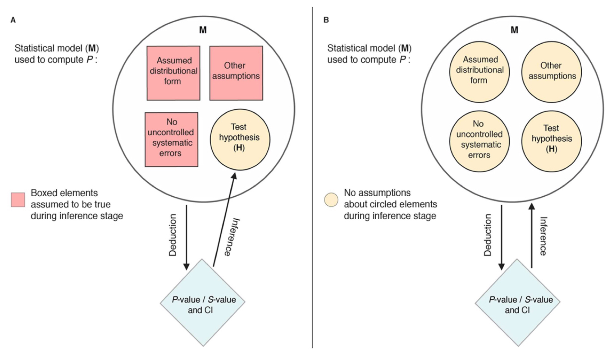
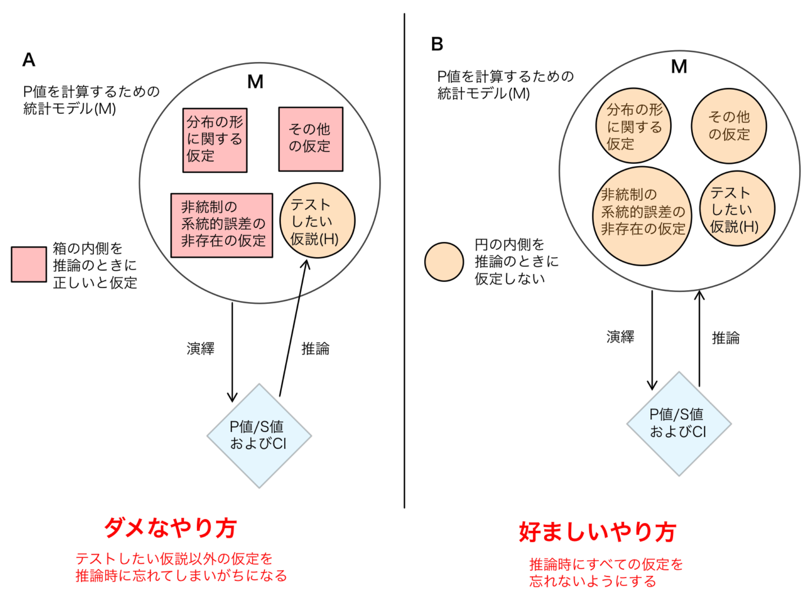

---

**Slide 1**

**Advancing statistics reform: Ways to improve thinking and practice in the face of resistance,** 
evolved from:  
**‘Breaking the statistical tyranny over rational cognition’** 
**‘Cognition and causation before probability and inference’** 
**‘How to not lie with statistics:**
**use descriptive imagery, not inference**’  
**‘The need for cognitive science and causality in statistics
teaching and practice’ ‘Statistics as a condemned building: plans for
demolition and reconstruction’**

Sander Greenland, Dept of Epidemiology and Dept of Statistics, UCLA 
Please report errors and send comments to Sander Greenland at lesdomes@ucla.edu

1 June 2022 Greenland – Reforming Statistics 1

統計学改革の推進：抵抗に直面した思考と実践の改善策
元となったもの：
「合理的な認知に対する統計的専制を打ち破る」
「確率と推論の前の認知と因果関係」
「統計で嘘をつかない方法：推論ではなく記述的なイメージを用いる」
「統計教育と実践における認知科学と因果関係理論の必要性」
「統計学は取り壊し予定の建物：解体と再建の計画」
サンダー・グリーンランド、UCLA疫学部門および統計学部門
誤りの報告やコメントは Sander Greenland (lesdomes@ucla.edu) までお寄せください。

---

**Slide 2**

**Science progresses funeral by funeral,
but in statistics authority is immortal**

* **Heroic narrative:** Science progresses by each generation challenging the ideas of its predecessors, discarding those that fail stringent **empirical** tests.

* In contrast, **statistics has decayed by enshrining traditional methodologies,** and then defending them by academic mathematical and philosophical appeals, along with underplaying harms to public information.

1 June 2022 Greenland – Reforming Statistics 2

科学は葬式ごとに進歩するが、統計学では権威は不死身である

英雄的な物語：科学は各世代が先人の考えに挑戦し、厳格な経験的テストに失敗したものを捨てることで進歩する。

対照的に、統計学は伝統的な方法論を神聖化し、それを学術的な数学的および哲学的訴えで擁護し、公の情報への害を過小評価することで退廃してきた。

---

**Slide 3**

Consequence: Fig. 1 van Zwet & Cator 2021 Over a million z-values from Medline 1976-2019. Imputed curve right-skewed with >75% above 0:

1 June 2022 Greenland – Reforming Statistics 3

結果：図1 van Zwet & Cator 2021 Medline 1976-2019から抽出された100万以上のZ値。補間曲線は右に歪んでおり、75%以上が0を上回る：

---

**Slide 4**

* Sanktification of cognitive biases (like nullism and dichotomania) as “scientific principles”, treatment of mathematical frameworks as if physical realities (reification), and neglect of human biases (such as craving certainty and finality) have rotted the core of statistics.

* A solution: Reconstruct statistics as an information science, not as a branch of probability theory, with cognitive science and causality theory as core components.

1 June 2022 Greenland – Reforming Statistics 4

* 認知バイアス(ゼロ仮説主義や二分法病など)を「科学的原則」として神聖化すること、数学的枠組みを物理的現実であるかのように扱うこと(モデルと現実の混同)、そして人間のバイアス(確実性や最終性を切望するなど)を無視することが、統計学の核心を腐敗させてきた。

* 解決策：統計学を確率論の一分野としてではなく、認知科学と因果関係理論を中核要素とする情報科学として再構築する。

---

**Slide 5**

In the radical Bayesianism of DeFinetti, all probability is “subjective” – describing only properties of observer’s minds. In that view

* The idea that patterns are “caused by chance” is
absurd as a causal statement about the world;

* Rather, we seek causal explanations for a
recognized pattern by considering a highly nonrandom (biased) selection of the few causal possibilities that are put forth as plausible;

* We then reify the residual infinitude of unconsidered causal explanations as forming a metaphysical cause called “chance”.

1 June 2022 Greenland – Reforming Statistics 5

DeFinettiのラディカル・ベイズ主義では、すべての確率は「主観的」であり、観察者の心の性質のみを記述する。その見方では

* パターンが「偶然によって引き起こされる」という考えは、
世界に関する因果的な言明としては不合理である。

* むしろ、我々は認識されたパターンに対する因果的説明を、妥当であると提唱される少数の因果的可能性から、極めて非ランダムな(偏りのある)選択を考慮することによって探求する。

* 我々は次に、考慮されなかった残りの無限の因果的説明を、「偶然」と呼ばれる形而上学的な原因を形成するものとして、モデルと現実の混同を行う。

---

**Slide 6**

* All analyses should be viewed as part of a vastly incomplete sensitivity analysis.

* The frequentist vs Bayes controversy is a religious dispute that disappears under detailed logical analysis.

* Boxian view: Bayesian tools are for method and model building, frequentist tools are for their evaluation (many other useful combinations).

* Until recently, both “schools” failed to cover the essential causal/contextual dimension from which their methods should be derived.

1 June 2022 Greenland – Reforming Statistics 6

* すべての分析は、著しく不完全な感度分析の一部と見なされるべきである。

* 頻度論者とベイズ主義者の論争は、詳細な論理分析の下で消滅する宗教的な論争である。

* Box的な見方：ベイズツールは手法やモデル構築のため、頻度論ツールはその評価のためである(他の多くの有用な組み合わせがある)。

* 最近まで、両方の「学派」は、彼らの手法がそこから導き出されるべき必須の因果的／文脈的側面を網羅していなかった。

---

**Slide 7**

**What unifies these inference concepts? - Not probability, but causation:**

* Past causes: What caused (“explains”) our observations? which is asking about physical mechanisms, not abstractions of their behavior such as probabilities.

* Future effects: How will actions affect the future? which is asking how to change the behavior of mechanisms, such as actual event frequencies, not probability distributions.

* Example: What will be the effect of reforms?...

1 June 2022 Greenland – Reforming Statistics 7

**これらの推論の概念を統一するものは何か？ - 確率ではなく、因果関係である：**

* 過去の原因：我々の観察は何によって引き起こされたのか(「説明される」のか)？これは物理的メカニズムに関する問いであり、その振る舞いの抽象化(確率など)に関するものではない。

* 将来の影響：行動は将来にどのように影響するか？これは、確率分布ではなく、実際の事象の頻度などのメカニズムの振る舞いをどのように変えるかに関する問いである。

* 例：改革の効果はどうなるか？... 

---

**Slide 8**

Answer: **Any** reform that still leads to selective reporting based on study outcomes will distort the distribution of available outcomes relative to the total

1 June 2022 Greenland – Reforming Statistics 8

答え：研究結果に基づいて選択的な報告を依然として行う改革は、利用可能な結果の分布を全体に対して歪めるだろう。

---

**Slide 9**

**What is INFERENCE?**

* Dictionary example: “A conclusion reached
on the basis of evidence and reasoning.”

* Scientific inference is a complex but
narrowly moderated judgement about reality, based on this assumption: 
There is a logically coherent “objective” (observer-external) reality that causes our
perceptions according to discoverable laws:

My perception ← Reality → Your perception

* This makes inference part of cognitive science

1 June 2022 Greenland – Reforming Statistics 9

**推論とは何か？**

* 辞書的な例：「証拠と推論に基づいて到達した結論。」

* 科学的推論は複雑ではあるが、
現実についての狭く調整された判断であり、以下の仮定に基づいている： 
発見可能な法則に従って我々の知覚を引き起こす、論理的に首尾一貫した「客観的」(観察者外部)な現実がある：

私の知覚 ← 現実 → あなたの知覚

* これにより、推論は認知科学の一部となる。

---

**Slide 10**

**Contrast scientific inference to**

* “Statistical inference,” which in all formalisms, “schools” or toolkits, has become taking output from a data-processing program (learning algorithm) and generating “inferences” via decontextualized rules.

* It converts oversimplified models of the mechanisms generating the data – the causes of the data – into abstract probability distributions.

* The semantic void it leaves causes inferential errors and facilitates deception (self or other)

1 June 2022 Greenland – Reforming Statistics 10

**科学的推論と対比されるべきは、**

* 「統計的推論」である。これは、あらゆる形式主義、学派、ツールキットにおいて、データ処理プログラム(学習アルゴリズム)からの出力を受け取り、文脈から切り離された規則を介して「推論」を生成することになっている。

* それは、データを生成するメカニズム(データの原因)の過度に単純化されたモデルを、抽象的な確率分布に変換する。

* それが残す意味論的な空白は、推論の誤りを引き起こし、欺瞞(自己または他者)を助長する。

---

**Slide 11**

* Statistics ignored or denigrated semantics and ordinary language, favoring instead deceptive jargon promising “significance” and “confidence” even when studies provide nothing close without huge leaps of faith.

* This was done to sell technical products and services based on dense formalisms, notation, and artificial precision whose assumptions and dangers are poorly understood by most users and consumers in “soft sciences”

― note the parallel with medical-product sales!

1 June 2022 Greenland – Reforming Statistics 11

* 統計学は意味論や日常言語を無視または軽視し、代わりに、研究が大きな飛躍なしには何もそれに近いものを提供しない場合でさえ、「有意性」や「信頼性」を約束する欺瞞的な専門用語を好んだ。

* これは、「ソフトサイエンス」のほとんどの使用者や消費者にはその前提と危険性が十分に理解されていない、密度の高い形式主義、記法、人工的な精度に基づいた技術製品やサービスを販売するために行われた。

― 医療製品の販売との類似性に注目！

---

**Slide 12**

**The scientific community eagerly contributed to the degeneration of statistical science**

Rules that were apparently successful for narrow automated environments induced destructive feedback loops in teaching and research:

* Students want explicit practice rules for memorization to ensure correct answers.
* Instructors want ease of grading.
* Researchers want rules for submitting acceptable reports.
* Reviewers and editors want to ease reviewing and publication decisions.

1 June 2022 Greenland – Reforming Statistics 12

**科学界は統計科学の退化に熱心に貢献した。**

狭い自動化環境で成功したかのように見えた規則は、教育と研究において破壊的なフィードバックループを引き起こした：

* 学生は、正しい答えを保証するために、記憶するための明確な実践規則を求めている。
* 教員は、採点の容易さを求めている。
* 研究者は、受け入れられる報告書を提出するための規則を求めている。
* 査読者と編集者は、査読と出版の決定を容易にすることを求めている。

---

**Slide 13**

**The prevailing rules became especially popular and destructive via enforced dichotomies**

* **Dichotomies satisfy human drives for definitive conclusions**, since they apply even when the study (the real physical data generator) is incapable of forcing such conclusions if critically scrutinized.\*

\* apart from "more research is needed", although often even that isn’t justified in light of cost/benefit considerations and other studies.

1 June 2022 Greenland – Reforming Statistics 13

**普及した規則は、強制された二分法病によって特に人気があり、破壊的となった。**

* 二分法は、研究(実際の物理的なデータ生成器)が、厳密に吟味された場合、そのような結論を強要できない場合でも適用されるため、決定的な結論を求める人間の欲求を満たす。\*

\* 「さらなる研究が必要である」という場合を除いて、費用対効果の考慮事項や他の研究を考慮すると、それさえも正当化されないことが多い。

---

**Slide 14**

The degeneration of statistical science into a collection of mathematical skeletons left behind explication of and training in essential components of scientific inference:

* How causal networks (not probabilities) produce data, inferences, and decisions.

* How cognitive biases as well as procedural problems enter those causal networks.

* How valuations (motivations, goals, real costs and benefits) affect cognition and are implicit in all methodologies.

1 June 2022 Greenland – Reforming Statistics 14

統計科学が数学的な骨組みの集まりに退化し、科学的推論の本質的な構成要素の説明と訓練が置き去りにされた：

* 因果ネットワーク(確率ではない)がデータ、推論、決定をどのように生成するか。

* 認知バイアスや手続き上の問題がそれらの因果ネットワークにどのように入り込むか。

* 評価(動機、目標、実際のコストと利益)が認知にどのように影響し、すべての方法論に暗黙的に含まれているか。

---

**Slide 15**

* Ugly fact: The main problems of P-values will extend to any statistic, because they stem from truth-subverting (perverse) incentives and cognitive biases, not P-values

* Perverse incentives create cognitive biases (wishful thinking, mind projection) to see what the incentives dictate. These biases pervade reports in fields like medicine.

* Perceptions are currently manipulated to see incentives for positive reporting while ignoring incentives for negative reporting…

1 June 2022 Greenland – Reforming Statistics 15

* 醜い事実：P値の主な問題はあらゆる統計量に拡大するだろう。なぜなら、それらはP値からではなく、真実を覆すような(倒錯した)インセンティブと認知バイアスに起因するからである。

* 倒錯したインセンティブは、インセンティブが命じるものを見るために認知バイアス(希望的観測、心の投影)を生み出す。これらのバイアスは医学のような分野の報告に蔓延している。

* 現在、認識は、否定的な報告に対するインセンティブを無視しながら、肯定的な報告に対するインセンティブを見るように操作されている…

---

**Slide 16**

* Reasoning motivated by commitment to past teaching, past practice, and financial stakes drives resistance to serious reform

Example – a common label on dairy products: 
“*MILK from cows not treated with rBST. *No significant difference has been shown between milk derived from cows treated with rBST and those not treated with rBST”

― Here, a special-interest group forced a statement of fact to be accompanied by a misleading technical claim to benefit sales.

1 June 2022 Greenland – Reforming Statistics 16

* 過去の教え、過去の慣行、および経済的な利害へのコミットメントによって動機づけられた推論は、深刻な改革への抵抗を推進する。

例 – 乳製品によくある表示： 
「*rBST未処理の牛からの牛乳。*rBST処理された牛由来の牛乳と処理されていない牛由来の牛乳との間に有意な差は示されていない。」

― ここでは、特定の利益団体が、売上を有利にするために、事実表明に誤解を招く技術的な主張を付随させるよう強制した。

---

**Slide 17**

Millstone et al. Nature 1994: 8 trials, 19% average increase in somatic cell count (pus) in milk from cows treated with rBST (meta p=0.004):

1 June 2022 Greenland – Reforming Statistics 17

Millstone et al. Nature 1994: 8件の試験、rBST処理された牛の牛乳の体細胞数(膿)が平均19%増加(メタ分析 p=0.004)：

---

**Slide 18**

* The “replication crisis” is constantly portrayed as one of perverse incentives to make discoveries by searching out “statistical significance”, producing publication bias.

* Lowering significance thresholds only
increases the bias.

* Any selective publication based on outcomes damages goals of building complete, unbiased public data repositories.

* Yet defense and promotion of significance selection continues unabated…

1 June 2022 Greenland – Reforming Statistics 18

* 「再現性の危機」は、「統計的有意性」を探し求めることで発見をしようとする倒錯したインセンティブの一つとして常に描かれ、出版バイアスを生み出している。

* 有意水準を引き下げても、偏りはむしろ増すだけである。

* 結果に基づく選択的な出版は、完全で偏りのない公共データベースを構築するという目的を損なう。

* それにもかかわらず、有意性による選択の擁護と推進は今なお止むことがない……

---

**Slide 19**

More subtly, the standard “replication crisis” story ignores instances of perverse incentives to find and report negative results (e.g., by upward P-hacking or by misreporting ambiguous results as negative), for example

* When researchers, sponsors, and editors want
to dismiss undesirable associations; or

* When “replication failures” or other challenges to an association are more publishable than mere replication.

* Or both…

1 June 2022 Greenland – Reforming Statistics 19

* より巧妙には、標準的な「再現性の危機」の物語は、否定的な結果を見つけて報告するための倒錯したインセンティブの事例(例えば、上方P値操作や、曖昧な結果を否定的な結果として誤って報告することなど)を無視している。例えば

* 研究者、スポンサー、編集者が望ましくない関連性を却下したい場合、または「再現性の失敗」やその他の関連性への異議申し立てが、単なる再現よりも出版されやすい場合。

* またはその両方…

---

**Slide 20**

**A typical example** (Brown et al., “Association between serotonergic antidepressant use during pregnancy and autism spectrum disorder in children”, JAMA 2017;317:1544-52), abstract:

* “\[Cox-model\] adjusted HR, 1.59 \[95% CI, 1.17, 2.17\]). After IPTW HDPS, the association was not significant (HR, 1.61 \[95% CI: 0.997, 2.59\]).” (p = 0.0505)

* Their conclusion: “in utero exposure was not associated with autism spectrum disorder”

* Their earlier meta-analysis got HR 1.7 \[1.1, 2.6\]

1 June 2022 Greenland – Reforming Statistics 20

**典型的な例**(Brown et al., “Association between serotonergic antidepressant use during pregnancy and autism spectrum disorder in children”, JAMA 2017;317:1544-52)、要旨：

* 「\[Coxモデル\]調整済みHR、1.59 \[95%信頼区間、1.17, 2.17\])。IPTW HDPS後、関連性は有意ではなかった(HR、1.61 \[95%信頼区間：0.997, 2.59\])。」(p = 0.0505)

* 彼らの結論：「出生前曝露は自閉症スペクトラム障害とは関連がなかった。」

* 彼らの以前のメタ分析ではHR 1.7 \[1.1, 2.6\]が得られていた。

---

**Slide 21**

Articles decrying this sort of misreporting date at least back to Karl Pearson 1906:

* “The absence of significance relative to the size of the samples is too often interpreted by the casual reader as a denial of all differentiation, and this may be disastrous.”

Innumerable others have repeated this caution for over a century since…

Why does it continue in such naked forms? Is it mere ignorance? No, I posit it’s forced on authors to protect industry against litigation.

1 June 2022 Greenland – Reforming Statistics 21

このような誤った報告を非難する記事は、少なくとも1906年のカール・ピアソンまで遡る：

* 「サンプルサイズに対して有意性が欠如していることは、一般読者によって、すべての分化の否定として解釈されることが多すぎるが、これは悲惨なことになる可能性がある。」

それ以来1世紀以上にわたり、無数の人々がこの警告を繰り返してきた… 

なぜこのような露骨な形でこれが続くのだろうか？単なる無知だろうか？いや、私はこれが産業を訴訟から守るために著者に強制されているのだと仮定する。

---

**Slide 22**

“…**the distinction between statistical significance and social importance should be apparent to all research workers**… upon us is placed the responsibility of determining whether real differences exist and then of indicating their social importance **and their cost**. **When we fail to find any statistically significant differences, we are not justified in concluding at once that no real differences exist**.” – P. 118 of JW Tyler, Educational Research Bulletin, Mar. 4, 1931

1 June 2022 Greenland – Reforming Statistics 22

「…**統計的有意性と社会的重要性の区別は、すべての研究者に明らかであるべきだ**… 我々には、現実の違いが存在するかどうかを判断し、その社会的重要性と**コスト**を示す責任が課せられている。**統計的に有意な差を見つけられなかった場合、現実の違いが全く存在しないとすぐに結論づける正当な理由はない**。」 – JW Tyler, Educational Research Bulletin, 1931年3月4日号, p. 118

---

**Slide 23**

“One of the most pernicious abuses of automated decision making occurs when clinical treatments are asserted to be equivalent, based on a nonsignificant P-value for the observed difference…we should continue to resist any attempts to automate our decisions, as in formal hypothesis testing.” 
― Claire Weinberg, “**It’s Time to Rehabilitate the P-value**”, Epidemiology 2001; 12: 288-290.

1 June 2022 Greenland – Reforming Statistics 23

「自動化された意思決定の最も悪質な乱用の一つは、観測された差の非有意なP値に基づいて、臨床治療が同等であると断言されるときに発生する…我々は、形式的な仮説検定のように、意思決定を自動化しようとするいかなる試みにも抵抗し続けるべきである。」 
― Claire Weinberg, 「**P値を立て直す時が来た**」, Epidemiology 2001; 12: 288-290。

---

**Slice 24**

Brown et al. cited their own report of the same increased risk in their own meta-analysis of 4 earlier cohorts with HR 1.7 \[1.1, 2.6\] but…

* They did not attempt to combine their new study with those studies and

* They did not cite a 2016 meta-analysis by Healy et al. of 16 cohort studies with HR 1.74 \[1.19, 2.54\] and 5 case-control studies with HR 1.95 \[1.63, 2.34\]

Why no discussion of the consistent association of 60-70% higher risk among the exposed?

1 June 2022 Greenland – Reforming Statistics 24

Brown et al. は、以前の4つのコホートの彼ら自身のメタ分析における同じリスク増加(HR 1.7 [1.1, 2.6])の報告を引用したが…

* 彼らは新しい研究をそれらの研究と結合しようとしなかった。そして Healy et al. による2016年のメタ分析(コホート研究16件でHR 1.74 \[1.19, 2.54\]、ケースコントロール研究5件でHR 1.95 \[1.63, 2.34\])を引用しなかった。

* なぜ曝露群における60-70%高いリスクの一貫した関連性について議論しなかったのか？

---

**Slide 25**

That’s because most were certain this highly replicated association was pure confounding:

* Medscape 2017: “Use of antidepressants before and during pregnancy does not cause autism or ADHD new research shows. Three studies demonstrate that antidepressant use in pregnant women is likely not responsible for autistic spectrum disorders (ASDs) in children and that the association found in previous studies was likely due to confounding factors.”

1 June 2022 Greenland – Reforming Statistics 24

それは、ほとんどの人が、この高度に再現された関連性が純粋な交絡であると確信していたからである。

* Medscape 2017：「抗うつ薬の使用は妊娠前および妊娠中の期間中に、自閉症やADHDを引き起こすものではないことが新しい研究で示されている。3つの研究は、妊婦における抗うつ薬の使用が子供の自閉症スペクトラム障害(ASDs)の原因である可能性は低く、以前の研究で見られた関連性は交絡因子による可能性が高いことを示している。」

---

**Slide 26**

The dominant social bias talks as if all incentives are to “discover” rather than to refute effects. This meta-bias is rampant in the “replication crisis” literature, which uncritically ignores differences in incentives across topics and authors.

* The Brown et al. example has the appearance of CI-hacking to increase width by adjusting until the CI finally includes 1 (even though adjustments beyond the initial Cox model have the appearance of overadjustments, inflating variance without removing bias).

1 June 2022 Greenland – Reforming Statistics 26

支配的な社会的バイアスは、すべてのインセンティブが効果を反駁することではなく、「発見する」ことにあるかのように語る。このメタバイアスは、「再現性の危機」に関する文献に蔓延しており、トピックや著者によるインセンティブの違いを無批判に無視している。

* Brown et al. の例は、CIが最終的に1を含むまで調整して幅を広げるという、信頼区間操作(CI-hacking)のように見える(ただし、最初のCoxモデルを超えた調整は、バイアスを除去せずに分散を膨張させる過剰調整のように見える)。

---

**Slide 27**

The point is not to argue that prenatal SSRIs cause ASD (massive topic!), but rather that

* “Spin” is the driver through The Garden of
Forking Paths: “objective” statistics are perceived, selected, and reported based on preferred causal stories and, in high-stakes settings, political and litigation concerns.

* Examples abound throughout health and medical sciences – which should scare you!

* Statistical training that pretends otherwise obscures and fosters this manipulation.

1 June 2022 Greenland – Reforming Statistics 27

重要な点は、出生前のSSRIがASDを引き起こすかどうかを議論することではない(これは巨大なテーマである！)が、むしろ

* 「スピン」(有利なように見せかけること)が、フォークする道の庭(Garden of Forking Paths)を通る推進力であるということである：「客観的な」統計量は、好ましい因果関係の物語に基づいて、そして高リスクの状況では、政治的および訴訟上の懸念に基づいて認識され、選択され、報告される。

* 例は健康科学や医学科学全体に豊富に存在する – これはあなたを恐れさせるべきだ！

* そうではないと装う統計教育は、この操作を曖昧にし、助長する。

---

**Slide 28**

* The causal stories that “we” (researchers, reviewers, and editors) want believed causally affects analysis choices and output interpretation. The result is that reports often function as lawyering for those stories.

* A major source of blindness to the problem is pundits in statistics and “meta-research” neglecting their own cognitive and political biases and training deficiencies, as well as the deficiencies of developers, instructors, users, and consumers of statistics.

1 June 2022 Greenland – Reforming Statistics 28

* 「我々」(研究者、査読者、編集者)が信じさせたい因果関係の物語は、分析の選択と出力の解釈に因果的に影響する。その結果、報告書はしばしばそれらの物語のための弁護士業務として機能する。

* この問題に対する盲点の主要な原因は、統計学や「メタ研究」の専門家が、自分自身の認知バイアスや政治的バイアス、訓練の欠陥、さらには統計学の開発者、教員、使用者、消費者の欠陥を無視していることである。

---

**Slide 29**

* Romantic heroic-fantasy science: Committed to fact-finding and dissemination of valid facts regardless of the social consequences…

* but almost no one would disseminate all valid facts regardless of the consequences.

* Harsh reality: Much of statistics serves commitments of major social networks to warp portrayal of facts into propaganda to direct society according the network’s valuations and special interests.

1 June 2022 Greenland – Reforming Statistics 29

* ロマンチックな英雄的ファンタジー科学：社会的結果に関係なく、事実発見と有効な事実の普及にコミットしている…

* しかし、結果に関係なくすべての有効な事実を普及させる人はほとんどいないだろう。

* 厳しい現実：統計学の大部分は、主要なソーシャルネットワークのコミットメントに奉仕し、事実の描写を歪曲してプロパガンダに変え、ネットワークの価値観と特別な利益に従って社会を方向づける。

---

**Slide 30**

Example: The endless expert “EBM” promotion of randomized trials as “gold standards” when they are no such thing due to

* Huge generalization bias due to exclusion of high-risk patients on ethics and liability grounds, and placebo formulas that have real side effects

* Numbers too small and follow-up too short to discern adverse effects, resulting non-significance reported as “replication failure”

* Hidden protocol violations plus selective publication, reporting, and discussion …

1 June 2022 Greenland – Reforming Statistics 30

例：ランダム化比較試験(RCT)を「ゴールドスタンダード」として専門家が際限なく「EBM」で推進しているが、実際にはそうではない。その理由は以下の通りである。

* 倫理的および法的責任の理由で高リスク患者が除外されることによる大きな一般化バイアス、および実際の副作用があるプラセボ製剤

* 有害事象を識別するには参加者数が少なすぎ、追跡期間が短すぎるため、結果として有意差がないことが「再現性の失敗」として報告される

* 隠されたプロトコル違反に加えて、選択的な出版、報告、議論…

---

**Slide 31**

**A typical example**: RCT by Vallejos et al. ‘Ivermectin to prevent hospitalizations in patients with COVID-19’ BMC ID 2 July 2021…

* Abstract: OR = 0.65; 95% CI 0.32, 1.31; p = .23 reported as “Ivermectin had no significant effect on preventing hospitalization”.

* Gideon M-K “Health Nerd” (Medium 16 July 2021) wrote that the trial “found no benefit for ivermectin on death” – BUT p. 5 of Vallejos et al.: OR = 1.34, 95% CI 0.30, 6.07 from 4 ivermectin + 3 placebo deaths.

* The trial was too small to show anything! 1 June 2022 Greenland – Reforming Statistics 31

1 June 2022 Greenland – Reforming Statistics 31

典型的な例：Vallejos et al. によるRCT「COVID-19患者の入院を予防するためのイベルメクチン」 BMC ID 2021年7月2日…

* 要旨：OR = 0.65; 95%信頼区間 0.32, 1.31; p = .23
と報告され、「イベルメクチンは入院予防に有意な効果はなかった」。

* Gideon M-K「ヘルスナード」(Medium 2021年7月16日)は、この試験が「イベルメクチンの死亡に対する効果は認められなかった」と書いた – しかし、Vallejos et al. のp. 5には：イベルメクチン群4名+プラセボ群3名の死亡からのOR = 1.34, 95%信頼区間 0.30, 6.07。

* この試験は何かを示すには小さすぎた！

---

**Slide 32**

Survey from MedPage Today May 21, 2021: “Bait and Switch in IBD Trials? Primary outcomes often go unreported or changed midstream”

* “Analysis of 57 phase III trials with published
results indicated that half \[~50%\] either never reported at least one of the prespecified primary outcomes (17.5%) or at least one was changed without explanation (33.3%).”

Other studies found many registered trials are never published despite stated intent to do so.

1 June 2022 Greenland – Reforming Statistics 32

MedPage Today 2021年5月21日からの調査：「IBD試験におけるベイトアンドスイッチ(おとり商法)？主要評価項目はしばしば報告されないか、途中で変更される」

* 「公開された結果を持つ57件の第III相試験の分析は、半数\[約50%\]が事前に指定された主要評価項目の少なくとも一つを全く報告しなかった(17.5%)、または少なくとも一つが説明なく変更された(33.3%)ことを示した。」

他の研究では、多くの登録された試験が、その旨を明記しているにもかかわらず、決して出版されないことがわかった。

---

**Slide 33**

Empirical fact: We are all stupid (if not corrupt)

Amos Tversky: “My colleagues they study artificial intelligence; me, I study natural stupidity.”

“Whenever there is a simple error that most laymen fall for, there is always a slightly more sophisticated version of the same problem that experts fall for.”

Example: P-value = “probability of the null” vs. P-value = “probability chance alone produced the association” – but “chance alone” is the null!

1 June 2022 Greenland – Reforming Statistics 33

経験的事実：我々は皆愚かである(腐敗していないとしても)

Amos Tversky：「私の同僚は人工知能を研究している。私は自然な愚かさを研究している。」

「ほとんどの素人が陥る単純な誤りがあるとき、専門家が陥る同じ問題の少し洗練されたバージョンが必ず存在する。」

例：P値 = 「帰無仮説の確率」対 P値 = 「偶然のみが関連性を生み出した確率」 – しかし、「偶然のみ」こそが帰無仮説である！

---

**Slide 34**

**Empirical fact:** Incompetence among the exalted is the norm

Tversky: “It's frightening to think that you might not know something, but more frightening to think that, by and large, the world is run by people who have faith that they know exactly what is going on.” 
― Equally true in research and methodology!

* The Covid-19 pandemic has supplied us with vivid real-world examples – but no agreement about who those examples are.

1 June 2022 Greenland – Reforming Statistics 34

**経験的事実：** 高く評価されている人々の中に無能がいるのは、むしろ当たり前のこと。

ツヴェルスキー：「自分が何かを知らないかもしれないと考えるのは怖い。しかしもっと怖いのは、世界の大半が“自分は何が起きているかを正確に理解している”と信じている人々によって動かされているという事実だ。」 
― これは研究や方法論の世界でも、まったく同じことが言える！

* 新型コロナウイルスのパンデミックは、このことを如実に示す現実世界の例を私たちに与えた —— ただし、それが誰を指すのかについては、まったく合意が得られていない。

---

**Slide 35**

* Kahneman: “People assign much higher probability to the truth of their opinions than is warranted.”

* By sanctifying pure opinion, Bayesian methods open statistics to even more abuse via prior spikes and “elicited priors” (summary expressions of biases, literature misreadings, and personal prejudices).

* ― Example: Claiming Pr(null)=0.5 is “indifference” is massive null bias, not indifference.

1 June 2022 Greenland – Reforming Statistics 35

* Kahneman：「人々は、保証されている以上に、自分たちの意見の真実性に遥かに高い確率を割り当てる。」

* 純粋な意見を神聖化することにより、ベイズ法は事前確率スパイクや「引き出された事前確率」(バイアス、文献の誤読、個人的偏見の要約表現)を介して、統計学をさらに多くの乱用に対して開く。

* ― 例：Pr(null)=0.5が「無関心」であると主張することは、無関心ではなく、重大なゼロ仮説バイアスである。

---

**Slide 36**

Yet more Kahnemann:

* “We can be blind to the obvious, and we are also blind to our blindness.”

And most relevant to statistics in soft sciences:

* “…illusions of validity and skill are
supported by a powerful professional culture. We know that people can maintain an unshakeable faith in any proposition, however absurd, when they are sustained by a community of like-minded believers.”

― See: Any defense of significance testing…

1 June 2022 Greenland – Reforming Statistics 36

さらにKahnemann：

* 「我々は明白なことに対して盲目であり、そして我々は我々の盲目さに対しても盲目である。」

そしてソフトサイエンスにおける統計学に最も関連することとして：

* 「…妥当性とスキルの錯覚は強力な専門文化によって支えられている。我々は、人々が、たとえどんなに不合理な提案に対しても、同意見の信者のコミュニティによって支えられるとき、揺るぎない信仰を維持できることを知っている。」

― 参照：有意性検定のいかなる擁護も…

---

**Slide 37**

Example: “if the p-value for the effect is greater than the journal’s threshold p-value, then the editor can immediately reject the paper, which saves the journal from spending any more time on the (unconvincing) paper…if a result is statistically significant, this means no more than that there is enough weight of evidence for the studied effect to make the paper reporting the effect worth considering for publication.” 
― Fisher 1920s? No, Statistics 2021: Mcnaughton, The War on Statistical Significance.

1 June 2022 Greenland – Reforming Statistics 37

例：「効果のp値がジャーナルの閾値p値より大きい場合、編集者はその論文を直ちに却下でき、それによってジャーナルはその(説得力のない)論文にそれ以上の時間を費やすことを避けることができる…結果が統計的に有意である場合、これは、研究された効果に対する証拠の十分な重みがあり、その効果を報告する論文が出版を検討する価値があるという以上の意味はない。」  
― これは1920年代のFisherですか？ いいえ2021年の統計学です：Mcnaughton, *The War on Statistical Significance*.。

---

**Slide 38**

Ignores a fact noted by the 1950s: Any selective reporting based on study outcomes will distort the distribution of available outcomes relative to the total

1 June 2022 Greenland – Reforming Statistics 38

1950年代には指摘されていた事実を無視している：研究結果に基づくいかなる選択的報告も、利用可能な結果の分布を全体に対して歪めるだろう。

---

**Slide 39**

Any instruction purporting to cover the basics of inference needs to include cognitive science to deal with social delusions and biases such as

* Nullism: Confusion of our need for parsimony (or shrinkage to zero) with reality.

* Dichotomania: Confusion of our need for summarization (simplification) and decision with our preference for black-or-white thinking.

* Reification: Faith that formal methods for reasoning, inference, and decision suffice for real-world reasoning, inference, and decision.

1 June 2022 Greenland – Reforming Statistics 39

推論の基礎を網羅すると称するいかなる指導も、社会的妄想やバイアスに対処するために認知科学を含める必要がある。例えば、

* ゼロ仮説主義()：我々の単純性の必要性(またはゼロへの収縮)を現実と混同すること。

* 二分法病(dichotomania)：要約(単純化)と決定の必要性を、白黒思考への我々の好みと混同すること。

* モデルと現実の混同(Reification)：形式的な推論・推測・意思決定の手法だけで、現実世界における推論・推測・意思決定も十分に行えると信じること。

---

**Slide 40**

Nullism has a long and glorious history among physics idolaters as pseudo-skepticism (empirically indefensible certainty about nulls):

* “Heavier than air flying machines are impossible” – Lord Kelvin 1895, repeated 1902

* “Continental drift is out of the question” because no mechanism is strong enough – Sir Harold Jeffreys, geophysicist originator of spiked priors = formalized overconfidence.

* See also Fisher arguing against cigarettes causing lung cancer, despite extensive evidence.

1 June 2022 Greenland – Reforming Statistics 40

ゼロ仮説主義は、物理学偶像崇拝者の間で疑似懐疑論として長く輝かしい歴史を持っている(経験的に擁護できない帰無仮説に関する確実性)：

* 「空気より重い飛行機械は不可能である」 ― ケルビン卿 1895年、1902年に繰り返される

* 「大陸移動は論外である」 なぜなら十分な強さを持つメカニズムが存在しないからだ ― ハロルド・ジェフリーズ卿、スパイク事前確率の創始者である地球物理学者 = 形式化された過信。

* また、広範な証拠があるにもかかわらず、タバコが肺がんを引き起こすことに反対するフィッシャーも参照。

---

**Slide 41**

* Against Nullism: Reality is under no obligation to be simple or decisive.

* Against Dichotomania: Many if not most important decisions are not or should not be binary: Where do you set your oven? Your thermostat? Your medication level?

* Hidden Reification: Researchers routinely publish “inferences” that ignore vast model uncertainties – they don’t know a rationale for neglecting all the simplifications in their models, and they just don’t think about them.

1 June 2022 Greenland – Reforming Statistics 41

* ゼロ仮説主義(nullism)に反対する：現実は単純であるか決定的である義務はない。

* 二分法病(dichotomania)に反対する：多くの、もしそうでなければ最も重要な決定は、二元的ではない、またはそうであるべきではない：オーブンはどこに設定しますか？サーモスタットは？薬のレベルは？

* 隠されたモデルと現実の混同(hidden reification)に反対する：研究者は日常的に、広範なモデルの不確実性を無視した「推論」を発表している – 彼らはモデルにおけるすべての単純化を無視する理由を知らず、それについて考えてすらいない。

---

**Slide 42**

Many other cognitive biases contribute to design, analysis, reporting, publication biases 
https://en.wikipedia.org/wiki/List_of_cognitive_biases

All of the following and more should form part of basic training for moderating inferences:

* Anchoring to perceived consensus and desired yet erroneous belief even after correction.

* Confirmation bias: selective focus on desirable evidence and neglect of undesirable evidence.

* Courtesy bias: Tendency to be obscure about criticisms that will cause offense.

1 June 2022 Greenland – Reforming Statistics 42

他の多くの認知バイアスが、デザイン、分析、報告、出版のバイアスに寄与している。 
https://en.wikipedia.org/wiki/List_of_cognitive_biases

以下のすべてとそれ以上が、推論を調整するための基本訓練の一部を形成すべきである：

* 認識されたコンセンサスと望ましい、しかし誤った信念への固着(修正後であっても)。

* 確証バイアス：好ましい証拠に選択的に焦点を当て、望ましくない証拠を無視すること。

* 配慮バイアス：不快感を与える批判について不明瞭にする傾向。

---

**Slide 43**

* Failure to test alternatives (“congruence bias”)

* Selective criticism of undesirable evidence.

* Selective reasoning to desired conclusions via selective assumptions, explanations, and data.

* Dunning–Kruger effects: The less expertise, the more the overestimation of one’s competence (as in researchers’ overestimation of their statistical expertise, e.g., statistical editors of med journals).

* Overconfidence, validity illusions: The tendency to think methods or judgments are as accurate about the world as they are in the math (thought experiments) used to derive them.

1 June 2022 Greenland – Reforming Statistics 43

* 代替案をテストしないこと(「合同バイアス」)。

* 望ましくない証拠に対する選択的な批判。

* 選択的な仮定、説明、データによる

* 望ましい結論への選択的な推論。

* ダニング＝クルーガー効果：専門知識が少ないほど、自分の能力を過大評価する(例えば、医学雑誌の統計編集者における、研究者の統計専門知識の過大評価など)。

* 過信、妥当性の錯覚：方法や判断が、それらを導き出すために使用される数学(思考実験)において正確であるのと同様に、世界についても正確であると考える傾向。

---

**Slide 44**

* Familiarity bias – over-reliance on familiar methods, ignoring alternative approaches (“gets me grants and papers, so no need to change”).

* Territorial (exclusionary) bias – promoting familiar methods as exclusively correct approaches, thus protecting self-authority and preventing competition from gaining ground (“Strictly Ballroom” effect: You can’t be an authority about what you haven’t studied and used extensively).

* Groupthink and herd-behavior biases such as repetition bias (echo-chamber effect, group reinforcement causing overcount of evidence).

1 June 2022 Greenland – Reforming Statistics 44

* 親近性バイアス – 慣れ親しんだ方法への過度の依存、代替アプローチの無視(「これにより助成金や論文が得られるのだから、変える必要はない」)。

* 縄張り(排他的)バイアス – 慣れ親しんだ方法を唯一正しいアプローチとして推進し、自己の権威を守り、競争相手が進出するのを防ぐ(「ストリクトリー・ボールルーム」効果：徹底的に研究し使用していないことについて権威であることはできない)。

* 集団思考と群集行動バイアス、例えば反復バイアス(エコーチャンバー効果、証拠の過剰計数を引き起こす集団強化)。

---

**Slide 45**

* Mind-projection fallacies: Imbuing inert quantities with attitudes, opinions, values, inferences, judgments, and decisions.

― Rampant in statistical discussions, thanks to using value descriptors like “significance”, “confidence” and “severity” for narrow math concepts that cannot capture the word meanings.

* Top example of nonsense: “P-values overstate evidence.” P-values only provide the position of a statistic in a reference distribution (e.g., chi-squared) derived from a model. Any evidence overstatement is by the viewer.

1 June 2022 Greenland – Reforming Statistics 45

*心の投影の誤謬：不活性な量に態度、意見、価値、推論、判断、および決定を吹き込むこと。

― 言葉の意味を捉えることができない狭い数学的概念に対して、「有意性」、「信頼性」、「厳しさ」のような価値記述子を使用しているため、統計的議論で蔓延している。

* ナンセンスの最たる例：「P値は証拠を過大に表現している。」P値は、モデルから導出された参照分布(例えばカイ二乗分布)における統計量の位置を提供するだけである。証拠の過大表現は観察者によるものである。

---

**Slide 46**

These are not absolute or sharp categories, but rather are heuristic triggers to avoid getting lulled or suckered by colleagues (however well-meaning), “experts,” and most of all ourselves. Example:

* A Dunning-Kruger form of overconfidence bias that is rampant among medical pundits (and not only when they comment on statistical methods): We may know our specialty superbly, but not realize how that expertise doesn't instantly generalize to other topics. True even for topics we think are close to our specialty, but actually have a lot more literature than we are aware of.

1 June 2022 Greenland – Reforming Statistics 46

これらは絶対的または明確なカテゴリーではなく、むしろ同僚(どんなに善意であっても)、「専門家」、そして何よりも自分自身に騙されたり欺かれたりしないようにするためのヒューリスティックなトリガーである。例：

* 医学専門家の間で蔓延しているダニング＝クルーガー型の過信バイアス(統計的手法についてコメントする場合に限らない)：我々は自分の専門分野を素晴らしく知っているかもしれないが、その専門知識が他のトピックにすぐには一般化しないことを理解していない。自分たちの専門分野に近いと思っているトピックでさえも、実際には我々が知っているよりもはるかに多くの文献が存在する場合でも、これは当てはまる。

---

**Slide 47**

Systemic problems are major reasons why ‘most published research findings are false’:

* Like everyone, stat instructors, users, and consumers suffer from dichotomania, nullism, and reification: They crave true-or-false conclusions for null hypotheses and so will accept them from oversimplified models.

* But in “soft-science” applications, observations (even from RCTs) can never provide such absolute certainties, and can’t even provide accurate assessments of uncertainties.

1 June 2022 Greenland – Reforming Statistics 47

「発表された研究成果の大半が誤りである」とされる主な理由の一つは、体系的な問題にある：

* 誰もがそうであるように、統計学の教員、使用者、消費者は二分法病、ゼロ仮説主義、モデルと現実の混同に苦しんでいる。彼らは帰無仮説に対する真偽の結論を切望し、過度に単純化されたモデルからそれらを受け入れてしまう。

* しかし、「ソフトサイエンス」の応用においては、観察(RCTからであっても)は決してそのような絶対的な確実性を提供できず、不確実性の正確な評価さえも提供できない。

---

**Slide 48**

* Statistics caters to our cravings by providing sophisticated decision theories which make it appear to users that observations can provide definitive risk and uncertainty assessments.

* “Confidence intervals” perpetuate these illusions by deceptively appearing to capture all the uncertainty sources in applications, when the only uncertainty they capture is that given the model used to compute them.

* Worse, standard presentations rarely mention their neglect of model uncertainty!

1 June 2022 Greenland – Reforming Statistics 48

* 統計学は、洗練された決定理論を提供することで、ユーザーに観察が決定的なリスクと不確実性の評価を提供できるように見せかけ、我々の切望に応える。

* 「信頼区間」は、応用においてすべての不確実性の源を捉えているかのように欺瞞的に見えることで、これらの錯覚を永続させるが、それらが捉える不確実性は、計算に使用されたモデルを前提としたものだけである。

* さらに悪いことに、標準的なプレゼンテーションでは、モデルの不確実性の無視についてほとんど言及されない！

---

**Slide 49**

* Statistics also freely indulges in the ludic fallacy of treating all uncertainty as if from games of chance (random draws from a distribution of known form) instead of addressing our deep uncertainties about the form and causes of variation and bias.

* These problems underscore the need for coverage of causal reasoning errors and cognitive biases as an essential component of any specialty claiming to promote sound scientific inference from data.

1 June 2022 Greenland – Reforming Statistics 49

* 統計学はまた、すべての不確実性を偶然のゲーム(既知の形式の分布からのランダムな抽出)から来たかのように扱うという遊戯の誤謬に自由にふけり、変動とバイアスの形式と原因に関する我々の深い不確実性に対処しない。

* これらの問題は、データからの健全な科学的推論を促進すると主張するあらゆる専門分野の必須要素として、因果推論の誤りや認知バイアスを網羅する必要性を強調している。

---

**Slide 50**

* Mathematizations amplify overconfidence in these fallacies, making statistical theory a fountain of real-world misinformation:

* Math derivations only warrant certainty in conclusions (such as “optimality”) given their assumptions (e.g., that a small class of model candidates can approximate reality well).

* Yet the conclusions are then treated as self-evident truths, a feeling reinforced by commitment to previous training, teaching, and practice. The resulting shared cognitive biases are then reinforced by social feedback loops.

1 June 2022 Greenland – Reforming Statistics 50

* 数学化はこれらの誤謬に対する過信を増幅させ、統計理論を現実世界の誤った情報の源泉にしている：

* 数学的導出は、その仮定(例えば、少数の候補モデルクラスが現実をうまく近似できるという仮定など)が与えられている場合にのみ、結論(「最適性」など)の確実性を保証する。

* しかし、その結論は自明の真理として扱われ、これは以前の訓練、教育、実践へのコミットメントによって強化される感覚である。結果として生じる共有された認知バイアスは、社会的フィードバックループによってさらに強化される。

---

**Slide 51**

* The result is groupthink, hidden bias and circularity in arguments given by the most technically skilled proponents!

* Typified by common arguments for Neymanian and Bayesian primacy (worse than that seen in writings by Neyman or Bayes).

* Examples: Demanding calibration or Bayesian coherency as prime directives for real-world conclusions and decisions. Those are only directives within their representations, and can lead to disaster from uncaptured context.

1 June 2022 Greenland – Reforming Statistics 51

* 結果は、最も技術的に熟練した提唱者による議論における集団思考、隠されたバイアス、循環論法である！

* ネイマン流とベイズ流の優位性を主張する一般的な議論(ネイマンやベイズの著作に見られるものよりも悪い)に典型的に表れている。

* 例：現実世界の結論と決定に対する最優先の指令として、キャリブレーションやベイズ的整合性を要求すること。それらは彼らの表現内での指令にすぎず、捉えられていない文脈からの破滅につながる可能性がある。

---

**Slide 52**

**STOP treating mathematical justifications as if they are sufficient practical justifications**

* No matter how complex they look, math results are only thought experiments to test methods in idealized settings far simpler than real practice.

* Performance in these simple cases can provide guidance for practice, with warnings about problems and suggesting improvements for methods. But,

* Problems seen simple settings can get worse in complex settings, and

* Neither math “optimality” results nor failure to find problems in math settings guarantee good performance in real applications.

1 June 2022 Greenland – Reforming Statistics 52

* 数学的な正当化をあたかも十分な実践的な正当化であるかのように扱うのをやめなさい。

* どんなに複雑に見えても、数学的結果は、実際の実践よりもはるかに単純な理想化された設定で手法をテストするための思考実験にすぎない。

* これらの単純なケースでの性能は、問題に関する警告と方法の改善提案とともに、実践への指針を提供できる。しかし、

* 単純な設定で見られる問題は、複雑な設定では悪化する可能性があり、

* 数学的な「最適性」の結果も、数学的な設定で問題が見つからないことも、実際的な応用における良い性能を保証するものではない。

---

**Slide 53**

**Value bias pervades statistical methodology, most often in the form of nullism** 
(values biased toward “accepting” the null)

* Call a methodology value-biased when it
incorporates cost/benefit assumptions that are not shared by all stakeholders.

* These biases are usually obscured from public recognition by adherence to statistical traditions and mathematics that hide the values in the obscure cost/benefit assumptions of NHST and its Bayesian analogs.

1 June 2022 Greenland – Reforming Statistics 53

**価値バイアスは統計学的手法に蔓延しており、最も頻繁にはゼロ仮説主義の形をとる。** 
(「帰無仮説を受け入れる」ことに偏った価値観)

* すべての利害関係者によって共有されない費用対効果の仮定を
組み込んでいる場合、その方法論は価値バイアスがかかっていると言う。

* これらのバイアスは、NHSTとそのベイズ的類似物の不明瞭な費用対効果の仮定に価値観を隠す統計的伝統と数学への固執によって、通常、一般の認識から覆い隠されている。

---

**Slide 54**

* Example: Consistent use of the null as the test hypothesis, to the point of failing to distinguish between null and test hypotheses (a mistake traceable to Fisher).

* This is an example of nullism, value bias toward the null favoring those with stakes on the null (as found in product surveillance) and those with metaphysical beliefs in nulls (pseudo-skeptics who confuse parsimony heuristics with natural laws).

* Many researchers do not realize that any effect size can be given a P-value (“tested”).

1 June 2022 Greenland – Reforming Statistics 54

* 例：帰無仮説と検定仮説の区別をしないほど、帰無仮説を検定仮説として一貫して使用すること(フィッシャーに遡る誤り)。

* これはゼロ仮説主義の一例であり、帰無仮説に利害関係を持つ人々(製品監視で見られるように)や、帰無仮説に形而上学的な信念を持つ人々(単純性の発見的手法と自然法則を混同する疑似懐疑論者)を利する帰無仮説への価値バイアスである。

* 多くの研究者は、いかなる効果量にもP値を与えることができる(「検定される」)ということを認識していない。

---

**Slide 55**

* Via NHST, nullism has been taught as an integral part of Neyman-Pearson testing – even though it is not! From Neyman, Synthese 1977 p. 104, 106 (emphases added):

* “According to circumstances and according to the subjective attitudes of the research worker, one error may appear more important to avoid than the other; the error which is the more important to avoid will be called 'error of the first kind’” \[“Type-I” error, alpha error, incorrect rejection of the test hypothesis H\]

1 June 2022 Greenland – Reforming Statistics 55

* NHSTを介して、ゼロ仮説主義はネイマン＝ピアソン検定の不可欠な部分として教えられてきた – そうではないにもかかわらず！ネイマンの Synthese 1977 p. 104, 106 より(強調追加)：

* 「状況と研究者の主観的な態度に応じて、一方の誤りが他方の誤りよりも避けるべきより重要なものに見えることがある。避けるべきより重要な誤りを「第一種の誤り」と呼ぶだろう。」\[「第一種」誤り、アルファ誤り、検定仮説Hの誤った棄却\]

---

**Slide 56**

* “the [hypothesis] the unjust rejection of which constitutes the error of the first kind, will be called 'the hypothesis tested’.”

* Note how this description allows that the test hypothesis H may be non-null.

* “From the point of view of the manufacturer \[of a chemical A\] the error in asserting the carcinogenicity of A is (or may be) more important to avoid than the error in asserting that A is harmless. Thus, for the manufacturer, the 'hypothesis tested' may well be: 'A is not carcinogenic'.”

1 June 2022 Greenland – Reforming Statistics 56

* 「その不当な棄却が第一種の誤りを構成する[仮説]は、『検定される仮説』と呼ばれるだろう。」

* この記述が、検定仮説Hが非帰無仮説でありうることをどのように許容しているかに注目してほしい。

* 「\[化学物質Aの\]製造業者の観点からは、Aの発癌性を主張する際の誤りは、Aが無害であると主張する際の誤りよりも避けるべきより重要なものである(またはそうであるかもしれない)。したがって、製造業者にとって、『検定される仮説』は、『Aは発癌性がない』である可能性が高い。」

---

**Slide 57**

* “On the other hand, for the prospective user of chemical A the hypothesis tested will be unambiguously: 'A is carcinogenic'. In fact, this user is likely to hope that the probability of error in rejecting this hypothesis be reduced to a very small value!”

― This means anyone teaching, promoting, and using statistical tests must justify their choice of test hypothesis H as well as the cutoff used (whether that cutoff is for a P-value or a Bayes factor or a likelihood ratio).

1 June 2022 Greenland – Reforming Statistics 57

* 「一方、化学物質Aの将来の使用者にとっては、検定される仮説は明確に『Aは発癌性がある』であろう。実際、この使用者は、この仮説を棄却する際の誤りの確率が非常に小さな値に減らされることを望む可能性が高い！」

― これは、統計的検定を教え、推奨し、使用する者は、検定仮説Hの選択だけでなく、使用されるカットオフ(そのカットオフがP値、ベイズ因子、尤度比のいずれであるかにかかわらず)も正当化しなければならないことを意味する。

---

**Slide 58**

* Neyman thus provided a clear description of the role of values in choosing test hypotheses and how those can (and often will) vary within a topic across stakeholders.

* Yet many “opinion leaders” maintain rigid practices of testing only the null, based on faith in grossly oversimplified biological models, generalizations from selective observation, treating simplicity or parsimony heuristics as if they were metaphysical principles, and of course hidden valuations including service to sponsors or ideologies.

1 June 2022 Greenland – Reforming Statistics 58

* したがって、ネイマンは、検定仮説を選択する上での価値観の役割と、それらがどのように利害関係者の間でトピック内で異なりうるか(そしてしばしば異なる)を明確に記述した。

* しかし、多くの「オピニオンリーダー」は、著しく単純化された生物学的モデルへの信仰、選択的な観察からの一般化、単純性や節約の発見的手法を形而上学的な原則であるかのように扱うこと、そしてもちろんスポンサーやイデオロギーへの奉仕を含む隠された価値観に基づいて、帰無仮説のみを検定する厳格な慣行を維持している。

---

**Slide 59**

* We might be confident that any effect present is “small enough” so that the cost of ignoring it is acceptable - but that’s a value judgment!

* Statistical tests can be constructed for superiority, inferiority, non-superiority, non-inferiority, and even equivalence of treatments – but require artificially precise specifications of the effect sizes defining such declarations.

* P-values for such “boundary” effect sizes should be presented – and a P-value graph can show the P-values for all such choices.

1 June 2022 Greenland – Reforming Statistics 59

* 存在するいかなる効果も、「無視しても許容できるほど十分に小さい」と確信しているかもしれない – しかし、それは価値判断である！

* 統計的検定は、治療の優越性、劣等性、非優越性、非劣等性、さらには同等性のために構築できる – しかし、そのような宣言を定義する効果量の人工的に正確な仕様を必要とする。

* そのような「境界」効果量に対するP値は提示されるべきである ― そしてP値グラフは、すべてのそのような選択に対するP値を示すことができる。

---

**Slide 60**

**Multiplicity adjustments worsen value bias**

* They traditionally take the joint ensemble null
as the hypothesis most important to not reject incorrectly, and apply the Type-I error rate of 0.05 to the entire ensemble of nulls.

* They thus assume false-positive costs are always more than false-negative costs, and that these cost ratios always increase with the number of hypotheses - This valuation applies to drug companies monitoring adverse effects but not to patients!

1 June 2022 Greenland – Reforming Statistics 60

**多重性調整は数値のバイアスを悪化させる。**

* それらは伝統的に、複合的な帰無仮説全体を、誤って棄却しないことが最も重要な仮説とみなし、全体の帰無仮説集合に対して第一種の誤り率0.05を適用する。

* したがって、偽陽性のコストは常に偽陰性のコストよりも高く、これらのコスト比率は仮説の数とともに常に増加すると仮定している ― この価値判断は、有害事象を監視する製薬会社には当てはまるが、患者には当てはまらない！

---

**Slide 61**

* Null bias also afflicts a large portion of the Bayesian literature, where null spikes are used to misrepresent a belief that a parameter “differs negligibly” from the null.

* In most medical-research settings, concentration of prior probability around the null has no basis in real data. In fact prior spikes usually contradict genuine prior information. For example, potential medications are studied precisely because they are known to affect the targeted physiological system.

1 June 2022 Greenland – Reforming Statistics 61

* ゼロ仮説バイアスは、ベイズ文献の大部分にも影響を与えており、そこではパラメータが帰無仮説から「無視できるほど異なる」という信念を誤って表現するために帰無仮説スパイクが使用されている。

* ほとんどの医学研究の状況では、帰無仮説の周りに事前確率を集中させることは実際のデータに基づいているわけではない。実際、事前確率スパイクは通常、真の事前情報と矛盾する。例えば、潜在的な薬剤は、標的とする生理学的システムに影響を与えることが知られているからこそ研究されている。

---

**Slide 62**

Example: Again, fig. 1 of van Zwet & Cator 2021. Some Bayesians would shrink estimates toward 0 despite an imputed curve right-skewed with >75% above 0. Empirical Bayesians would instead use shrinkage toward estimated topic-specific means.

1 June 2022 Greenland – Reforming Statistics 62

例：再び、van Zwet & Cator 2021の図1。一部のベイズ主義者は、補間曲線が右に歪んでおり、75%以上が0を上回っているにもかかわらず、推定値を0に縮小させるだろう。経験的ベイズ主義者は代わりに、推定されたトピック固有の平均値に向かって縮小を使用するだろう。

---

**Slide 63**

**Part I summary:**

* Blind acceptance of mathematical frameworks, deification of “great men” and their conceptual errors, and neglect of cognitive problems have rotted the core of statistical training, practice, and the resulting store of public information.

* The “replication crisis” hysteria continues the problem via its nullism (neglect of testing alternatives), pointless dichotomania, and pernicious model reification, all of which are enshrined in NHST and null-spiked priors.

1 June 2022 Greenland – Reforming Statistics 63

**パートIの要約：**

* 数学的枠組みの盲目的な受け入れ、「偉大な人物」とその概念的誤りの神格化、そして認知的問題の無視が、統計的訓練、実践、そして結果として生じる公の情報貯蔵庫の核心を腐敗させてきた。

* 「再現性の危機」ヒステリーは、そのゼロ仮説主義(代替案の検定の無視)、無意味な二分法病、および有害なモデルと現実の混同によって問題を継続させている。これらはすべてNHSTと帰無仮説スパイク事前確率に神聖化されている。

---

**Slide 64**

* The persistent practical mistake promoted by statistical methodology: That we should want to construct real-world inferences using deductions from only one study, one set of background assumptions, one formal reasoning system, or one interpretation.

* Most writers accept the need for varied designs (not just “replications”) and varied assumptions (sensitivity analysis), yet seem unaware of (some even fight) the need for varying methodology and interpretations.

1 June 2022 Greenland – Reforming Statistics 64

* 統計学的方法論によって促進されている持続的な実践的誤り：我々は、たった一つの研究、一つの背景仮定のセット、一つの形式的な推論システム、または一つの解釈からの演繹を用いて現実世界の推論を構築したいと思うべきである、ということ。

* ほとんどの著者は、多様なデザイン(単なる「再現」だけでなく)と多様な仮定(感度分析)の必要性を受け入れているが、多様な方法論と解釈の必要性については unaware of (some even fight) 認識していないようである(一部はそれと戦うことさえある)。

---

**Slide 65**

* Statistical rules can worsen bad practices because their theories assume we will use only perfect interpretations of carefully controlled experiments, with a clear view of error costs.

* But most “data analysis” in soft-science research has been about applying decision rules to statistical outputs, based on defaults whose value-laden nature is not seen by most users and readers, e.g., requiring P<0.005 to report “association”, or misinterpreting P>0.05 as “no association.”

1 June 2022 Greenland – Reforming Statistics 65

* 統計的な規則は悪い慣行を悪化させる可能性がある。なぜなら、その理論は、誤差コストを明確に把握した上で、注意深く制御された実験の完璧な解釈のみを使用すると仮定しているからである。

* しかし、ソフトサイエンス研究におけるほとんどの「データ分析」は、ほとんどの使用者や読者にはその価値観に満ちた性質が見えていないデフォルトに基づいて、統計的な出力に決定規則を適用することであった。例えば、「関連性」を報告するためにP<0.005を要求することや、P>0.05を「関連性なし」と誤解することなど。

---

**Slide 66**

The bare, psychosocial facts:

* Most “objective” descriptions of statistical outputs are subjective interpretations, usually decision rules misrepresented as inference rules – which they are not, especially since decision rules require justified cost functions.

* Worse, the verbal definitions and descriptions found in most primers, tutorials, and textbooks are flat-out wrong, e.g. Cassidy et al. “Failing grade: 89% of introduction-to-psychology textbooks that define or explain statistical significance do so incorrectly”, AMPPS 2019

1 June 2022 Greenland – Reforming Statistics 66

むき出しの、心理社会的な事実：

* 統計的な出力のほとんどの「客観的な」記述は主観的な解釈であり、通常は推論規則として誤って表現された決定規則である – 決定規則は正当化された費用関数を必要とするため、特にそうではない。

* さらに悪いことに、ほとんどの入門書、チュートリアル、教科書で見られる言葉による定義と記述は全くもって間違っている。例えば、Cassidy et al. 「落第点：統計的有意性を定義または説明する心理学入門教科書の89%が間違っている」、AMPPS 2019

---

**Slide 67**

An urgent, neglected, yet easy step toward reform:

* Teach that data transforms are all that
statistics can supply. Examples: P-values, posterior probabilities, interval estimates.

* Observers supply meaning for statistics via causal models of the physical research reality.

Justified “statistical inferences” thus require

* showing how statistical assumptions can be derived from physical research reality; and

* showing where the data fall relative to what the assumptions taken together predict -which is what P-values do! Leading to…

1 June 2022 Greenland – Reforming Statistics 6

緊急かつ無視されているが、改革への容易な一歩：

* 統計学が提供できるのは、データ変換のみであることを教える。例：P値、事後確率、区間推定。

* 観察者は、物理的な研究現実の因果モデルを介して、統計量に意味を与える。

正当な「統計的推論」のためには、次のことが求められる：

* 統計的仮定が、実際の自然科学的な研究現実からどのように導かれるかを示すこと。

* データが、それらの仮定をすべて組み合わせたときの予測と比べてどこに位置するかを示すこと ― それこそがP値の役割である！ そしてこれが導くものは…

---

**Slide 68**

**Reform step: Extricate P-values from the dung-heap of null-hypothesis significance testing**

* Both critics and defenders of significance testing misidentify P-values with their traditional use in NHST. This is like calling all knives “weapons”: It’s confusion of a tool with its misuse (as in use of P-values in NHST to murder thought).

* That confusion is destructive because P-values can be used instead for many tasks divorced from NHST: as measurements of model fit, as estimation devices, and to build logical bridges connecting frequentist and Bayesian statistics.

1 June 2022 Greenland – Reforming Statistics 68

**改革の一歩：P値を帰無仮説有意性検定の糞の山から救い出す。**

* 有意性検定の批評家も擁護者も、P値をNHSTにおける伝統的な使用法と誤認している。これは、すべてのナイフを「武器」と呼ぶようなものである：それはツールの誤用(NHSTにおけるP値の使用で思考を殺害することなど)との混同である。

* その混同は破壊的である。なぜなら、P値はNHSTから切り離された多くのタスクのために使用できるからである：モデル適合度の測定として、推定ツールとして、そして頻度論統計学とベイズ統計学を結ぶ論理的な橋を構築するために。

---

**Slide 69**

**Challenges facing P-value rehabilitation once dichotomania and “significance” are banished**

* Instructors and users want P-values to be the
probability of a test hypothesis H (usually, a null hypothesis of no association or no effect).

* A P-value is usually not near that probability.

* Yet the teaching and research literature encourages subtle fallacious verbal descriptions that are equivalent to treating a P-values as if they were hypothesis probabilities (“P-inversion”).

1 June 2022 Greenland – Reforming Statistics 69

**二分法病と「有意性」が追放された後にP値の復権が直面する課題。**

* 教員と使用者は、P値が検定仮説Hの確率(通常は関連性なしまたは効果なしの帰無仮説)であってほしいと考えている。

* P値は通常、その確率には近くない。

* それでも、教育および研究文献はP値を仮説確率であるかのように扱うことと等価な、微妙で誤った言葉による説明(「P値の反転」)を奨励している。

---

**Slide 70**

**Ugly Fact: Valid interpretations of “inferential statistics” seem beyond most sources**

* The literature is filled with botched descriptions of P-values that confuse frequentist and Bayesian interpretations.

* Examples: inversions like “P is the probability the results are due to chance”, nonsense like “P is the probability of a chance finding”.

* Many descriptions of confidence intervals are actually defining posterior intervals, yet…

* 95% “confidence” intervals typically get treated as nothing more than 5%-level tests.

1 June 2022 Greenland – Reforming Statistics 70

**不都合な事実：「推論統計」の正しい解釈は、ほとんどの情報源にとって手に負えないように見える**

* 学術文献は、頻度主義的解釈とベイズ的解釈を混同したP値の誤った記述であふれている。

* 例：「P値は結果が偶然による確率である」といった逆転した誤解、「P値は偶然による発見の確率である」といった意味不明な表現など。

* 信頼区間の説明の多くは、実際には事後分布区間（posterior interval）を定義している内容になっているが、しかし……

* 95%信頼区間は、しばしば5%水準の有意性検定と何ら変わらないものとして扱われている。

---

**Slide 71**

**Inversion fallacies** include misinterpreting P-values as probabilities that “randomness” or “chance alone” **produced** an association…as in Harris & Taylor Medical Statistics Made Easy,\* 2nd ed, 2008, p. 24-25 say a P-value is “the probability of any observed differences having happened by chance” (alone?)

* **If the tested (“null”) model (of no effect or bias or mismodeling) is correct, what is the probability that a nonzero difference happened by chance alone?** Answer: 100%

\* (is “Made Easy” code for “Made Wrong”?)

1 June 2022 Greenland – Reforming Statistics 71

**逆転の誤謬(inversion fallacies)** には、P値を「ランダム性」や「偶然のみ」によって関連が**生じた**確率と誤解することが含まれる。
── たとえば、Harris & Taylor 『Medical Statistics Made Easy\*』(第2版, 2008年, pp.24–25)では、P値を「観察された差が偶然に起こった確率」であると述べている(「偶然のみで」？)

* **「検定された（帰無）モデル」（効果・バイアス・モデル誤指定がないという前提）が正しいとしたら、非ゼロの差が偶然によって生じる確率はいくらか？** 解答: 100%

\* (“Made Easy”は“Made Wrong”の婉曲表現？)

---

**Slide 72**

* Sound analyses need to see results as very fuzzy, often in an asymmetric way. But,

* Concepts of evidence and uncertainty can only be quantified relative to explicit models to which the data supposedly pertain, e.g.: 
― Data contrasted against model predictions
(compatibility checking = “tests of fit”, as in frequentist diagnostics), or 
― Data merged with models to update predictions or bets (as in Bayesian posterior computation).

1 June 2022 Greenland – Reforming Statistics 72

* 健全な分析では、結果を非常にあいまいなものとして、しばしば非対称的な方法で捉える必要がある。しかし、

* 証拠と不確実性の概念は、データが関連するとされる明示的なモデルに対してのみ定量化できる。例えば： 
― データとモデル予測との対比
(相性の良さの確認 = 「適合度検定」、頻度論的診断法のように)、または 
― データとモデルを統合して予測や賭けを更新する(ベイズ事後計算のように)。

---

**Slide 73**

**Reconstruct statistical training:** 
**STOP perpetuating the mistakes of “great men” of statistics and the cognitive biases they displayed, created, and encouraged**

* Statistics texts assume instructors and students understand logic and semantics enough to see through bad terminology and to discriminate mathematical from contextual meanings.

* As shown by complaints from before Fisher’s prime, that was never true and only worsened in the mid-20th century research explosion.

1 June 2022 Greenland – Reforming Statistics 73

**統計教育の再構築を：** 
**統計学の「偉人」たちの誤りや、彼らが示し・生み・助長した認知バイアスを、これ以上引き継ぐのはやめよう**

* 統計の教科書は、教員も学生も、誤った用語を見抜き、数学的な意味と文脈的な意味を区別できる程度には論理や意味論を理解していることを前提としている。

* しかし、フィッシャーが活躍する以前から寄せられていた批判が示すように、そうした理解は当時から存在しておらず、20世紀中頃の研究ブームで事態はさらに悪化した。

---

**Slide 74**

**Shift emphasis away from conditional “hypothesis-testing” interpretations to unconditional descriptive interpretations**

* The norm: “The P-value is the probability of getting a test statistic as or more extreme if the test hypothesis H is correct”, which leaves the background assumptions (model) implicit.

* Instead bring the assumptions forward, as in A P-value p is the percentile at which the test statistic falls under the test model.

* The test model includes the test hypothesis H and all other assumptions used to compute p.

1 June 2022 Greenland – Reforming Statistics 74

**条件付きの「仮説検定」的解釈から、無条件の記述的解釈へと重点を移す**

* 現在の標準的説明：「P値とは、検定仮説 H が正しいときに、得られた検定統計量と同じかそれ以上に極端な値が出る確率」── しかしこれは背景の仮定（モデル）を暗黙のものとしている。

* 代わりに、仮定を前面に出す説明に切り替える：「P値 p とは、検定モデルのもとで検定統計量が属するパーセンタイルである」

* 検定モデルとは、検定仮説 H に加え、P値 p を算出する際に用いたすべての仮定を含むものである。

---

**Slide 75**

from Greenland & Rafi “Semantic and cognitive tools to aid statistical science” http://arxiv.org/abs/1909.08583

1 June 2022 Greenland – Reforming Statistics 75

Greenland & Rafi 「統計科学を支援する意味論的および認知的ツール」より http://arxiv.org/abs/1909.08583

---

**Slide 76**

A test statistic measures discrepancy of data from predictions of a test model that contains both H and background assumptions.

The P-value is thus computed assuming the entire test model, not just H.

Deconditioning emphasizes that violations of any assumption used to derive the P-value can be responsible for its size, not just violation of the test hypothesis H.

A large P-value does not support or confirm H or the test model (absence of evidence is not evidence of absence of model violations).

1 June 2022 Greenland – Reforming Statistics 75

検定統計量は、Hと背景仮定の両方を含む検定モデルの予測からのデータの不一致を測定する。

したがって、P値はHだけでなく、検定モデル全体を仮定して計算される。

脱条件付けは、P値を導出するために使用されたいかなる仮定の違反も、検定仮説Hの違反だけでなく、その値の原因となりうることを強調する。

大きなP値は、Hまたは検定モデルを支持または確認するものではない(証拠の不在はモデル違反の不在の証拠ではない)。

---

**Slide 68**

Overthrow misleading traditional jargon (Statspeak) to realign statistical terminology
with ordinary language:
Replace “significance” (Edgeworth 1885) and
“confidence” (Neyman 1934) with compatibility* measured by the P-value p as it ranges from 0 = no compatibility to 1 = full compatibility of data with the test model used to compute p, in the direction measured by the test statistic. [*“Consistency” is nearly equivalent but is used for too many other concepts.]

1 June 2022 Greenland – Reforming Statistics 76

1 June 2022 Greenland – Reforming Statistics 76

統計用語を日常言語と再調整するために、誤解を招く伝統的な専門用語(統計 jargon)を覆す：
「有意性」(Edgeworth 1885)および
「信頼性」(Neyman 1934)を、P値pによって測定される相性の良さ*に置き換える。相性の良さ*は、pが0(相性の良さなし)から1(データとpを計算するために使用された検定モデルとの完全な相性の良さ)まで変化するにつれて、検定統計量によって測定される方向において示される。[*「整合性」はほぼ同等であるが、あまりにも多くの他の概念に使用されている。]

---

**Slide 69**

Why? Because typical modern users depend on words – for them the maths are simply symbolic incantations they must take on faith to get funded and published.

“That's just semantics” irresponsibly fails to grasp the essential analogical information conveyed by the semantics. That failure is common among the mathematically able, who place syntax and deduction above analogical processes, or dismiss or overlook the role of analogy in mapping between reality and math.

1 June 2022 Greenland – Reforming Statistics 77

1 June 2022 Greenland – Reforming Statistics 77

なぜか？それは、典型的な現代のユーザーは言葉に依存しているからである – 彼らにとって数学は、資金を得て出版するために信仰をもって受け入れなければならない単なる象徴的な呪文にすぎない。

「それは単なる意味論だ」と言うのは、意味論が伝える本質的な類推情報を捉え損ねる無責任な態度である。この失敗は、構文と演繹を類推プロセスの上に置く、あるいは現実と数学の間のマッピングにおける類推の役割を却下または見落とす、数学が得意な人々の間でよく見られる。

---

**Slide 70**

Stop repeating Fisher’s error of using “null hypothesis” for any test hypothesis
( an error which openly invites nullistic bias) “Null” in English Dictionaries:

Oxford: adj. 2. Having or associated with the
value zero; noun 1. Zero.
Merriam-Webster: adj. 6. Of, being, or
relating to zero; noun 7. Zero.
Instead, use Neyman’s term tested (or test)
hypothesis, and emphasize testing directional, non-null, and interval hypotheses instead of point null hypotheses.

1 June 2022 Greenland – Reforming Statistics 78

1 June 2022 Greenland – Reforming Statistics 78

いかなる検定仮説に対しても「帰無仮説」を使用するというフィッシャーの誤りを繰り返すのをやめなさい。
(これは露骨にゼロ仮説主義バイアスを招く誤りである) 英語辞書における「Null」：

Oxford: 形容詞 2. 値ゼロを持つ、またはそれに関連する；名詞 1. ゼロ。
Merriam-Webster: 形容詞 6. ゼロの、ゼロである、またはゼロに関連する；名詞 7. ゼロ。
代わりに、ネイマンの用語である検定された(または検定)
仮説を使用し、点帰無仮説ではなく、方向性のある、非帰無仮説、および区間仮説の検定を強調しなさい。

---

**Slide 71**

Get rid of Neyman’s “confidence trick”

Assigning high “confidence” is not distinct
from assigning high probability.

So: Rename and reconceptualize “CI” as
compatibility intervals showing parameter values found most compatible with the data under some compatibility criterion like P > 0.03 (which as shown below is about 5 coin-flips worth of evidence or less against any parameter value in the interval).

This involves no computational or numeric change! It’s all about perception…

1 June 2022 Greenland – P-values as evidence 80

1 June 2022 Greenland – P-values as evidence 80

ネイマンの「信頼のトリック」を取り除きなさい。

高い「信頼性」を割り当てることは、高い確率を
割り当てることと区別できない。

したがって：「信頼区間(CI)」を、何らかの相性の良さの基準(例えばP > 0.03)の下でデータと最も相性が良いと見なされたパラメータ値を示す相性区間として再命名し概念化しなさい(後述するように、これは区間内のいかなるパラメータ値に対しても、約5回のコイン投げの証拠以下に相当する)。

これには計算上または数値上の変更は一切伴わない！すべては認識の問題である…

---

**Slide 72**

“Compatible” is far more cautious (and logically much weaker) than “confidence”:

There is always an infinitude of possibilities (models) compatible with our data. Most are unimagined, even unimaginable given current knowledge.

We should recount the dogmatic denials by “great men” like Kelvin and Jeffreys of what became accepted facts.

“Confidence” implies belief and encourages the inversion fallacies that treat the CI as a credible posterior interval. In contrast…

1 June 2022 Greenland – P-values as evidence 81

1 June 2022 Greenland – P-values as evidence 81

「相性が良い」は「信頼性」よりもはるかに慎重であり(そして論理的にはるかに弱い)：

常に、我々のデータと相性の良い可能性(モデル)は無限に存在する。ほとんどは想像もされていない、現在の知識では想像すらできないものもある。

ケルビンやジェフリーズのような「偉大な人物」による、後に受け入れられた事実に対する独断的な否定を、我々は語り直すべきである。

「信頼性」は信念を暗示し、CIを信用できる事後区間として扱う逆転の誤謬を助長する。対照的に…

---

**Slide 73**

Compatibility is no basis for confidence:

False stories can be compatible with data
and lead to effective interventions.

Example: “Malaria is caused by bad air that
collects near the ground around swamps.”

Implied effective solutions: raise dwellings,
drain swamps – compatible cause (bad air) and actual cause (mosquitos) are both reduced by those interventions.

But confidence in the story will eventually mislead, e.g., it leads away from use of nets.

1 June 2022 Greenland – Reforming Statistics 82

1 June 2022 Greenland – Reforming Statistics 82

相性の良さは信頼性の根拠にはならない：

偽りの話はデータと相性が良く
効果的な介入につながる可能性がある。

例：「マラリアは沼地の近くの地面に溜まる悪い空気によって引き起こされる。」

示唆される効果的な解決策：住居を高くする、
沼地を排水する – 相性の良い原因(悪い空気)と実際の原因(蚊)は、どちらもこれらの介入によって減少する。

しかし、その話への信頼は最終的に誤解を招く。例えば、それは蚊帳の使用から遠ざかることにつながる。

---

**Slide 74**

Problem: The stated (“nominal”) coverage of a CI is a purely hypothetical frequency property
in which we should have no confidence!

“Confidence” requires us to know for certain
that the actual relative frequency with which the algorithmic interval covers the “true value” for the generator is as stated (eg 95%).

But the actual generator frequencies are unknown, so no such confidence is warranted.

The stated coverage thus refers only to repeated draws from a hypothetical data-generating algorithm, not to a causal story we are sure of.

1 June 2022 Greenland – Reforming Statistics 83

1 June 2022 Greenland – Reforming Statistics 83

問題：CIの示されている(「名目上の」)カバレッジは、純粋に仮説的な頻度プロパティであり、
それについて我々は信頼を持つべきではない！

「信頼性」は、生成器の「真の値」をアルゴリズム的区間がカバーする実際の相対頻度が、述べられている通りである(例えば95%)と
我々が確実に知っていることを要求する。

しかし、実際の生成器の頻度は未知であるため、そのような信頼性は正当化されない。

したがって、示されているカバレッジは、仮説的なデータ生成アルゴリズムからの繰り返しの抽出のみを参照し、我々が確信している因果関係の話を参照するものではない。

---

**Slide 75**

In contrast, compatibility is merely an observed relation between data and models

Compatibility only means the data set is “not far” (in percentile terms along the tested direction) from where it would be expected if it had come from the data-generating algorithm derived from the model under scrutiny.

A 95% compatibility interval (or region) shows results for every model having p > 0.05 in the tested direction. This a region of “high compatibility” when translated into a simple coin-tossing experiment, as described below.

1 June 2022 Greenland – Reforming Statistics 84

1 June 2022 Greenland – Reforming Statistics 84

対照的に、相性の良さは、データとモデルの間の単なる観測された関係である。

相性の良さは、データセットが、検討中のモデルから導出されたデータ生成アルゴリズムから来たとした場合に期待される位置から、(検定された方向でのパーセンタイルの観点から)「遠くない」ことを意味するだけである。

95%相性区間(または領域)は、検定された方向でp > 0.05となるすべてのモデルの結果を示す。これは、後述する簡単なコイン投げ実験に翻訳すると、「高い相性の良さ」の領域となる。

---

**Slide 76**

An honest report of Brown et al. JAMA 2017, “Association between serotonergic antidepressant [SSRI] use during pregnancy and autism spectrum disorder [ASD] in children”, could be:

Abstract: The Cox-model adjusted HR was 1.59,
95% compatibility limits (CL) 1.17, 2.17. Using IPTW HDPS, the HR estimate was much less precise (HR 1.61, 95% CL: 1.00, 2.59).

Conclusion: Under our HDPS model, the data appear most compatible with associations ranging from zero to a 2.6-fold elevation of ASD in children with in utero SSRI exposure.

1 June 2022 Greenland – Reforming Statistics 85

1 June 2022 Greenland – Reforming Statistics 85

Brown et al. JAMA 2017の正直な報告、「妊娠中のセロトニン系抗うつ薬[SSRI]の使用と子供の自閉症スペクトラム障害[ASD]との関連」は以下のようになるだろう：

要旨：Coxモデル調整済みHRは1.59、
95%相性の良さ限界(CL)は1.17、2.17であった。IPTW HDPSを使用すると、HR推定値ははるかに不正確になった(HR 1.61、95%相性の良さ限界：1.00、2.59)。

結論：我々のHDPSモデルの下では、データは、出生前SSRI曝露のある子供において、関連性がゼロからASDの2.6倍の増加までの範囲と最も相性が良いように見える。

---

**Slide 77**

An honest report of Vallejos et al. ‘Ivermectin to prevent hospitalizations in patients with COVID-19’ BMC ID 2 July 2021:

Abstract: The hospitalization odds ratio was 0.65,
95% compatibility limits (CL) 0.32, 1.31; the mortality odds ratio was 1.34, 95% CL 0.30, 6.07.

Conclusion: The results were too imprecise to determine the size or direction of the effect, being most compatible with hospitalization odds from 68% lower to 31% higher and mortality odds from 70% lower to 500% higher in the ivermectin group compared to the placebo group.

1 June 2022 Greenland – Reforming Statistics 86

1 June 2022 Greenland – Reforming Statistics 86

Vallejos et al. 「COVID-19患者の入院を予防するためのイベルメクチン」 BMC ID 2021年7月2日 の正直な報告：

要旨：入院オッズ比は0.65、
95%相性の良さ限界(CL)は0.32、1.31であった。死亡オッズ比は1.34、95%相性の良さ限界は0.30、6.07であった。

結論：結果は効果の大きさや方向を決定するにはあまりにも不正確であり、プラセボ群と比較してイベルメクチン群では、入院オッズが68%減から31%増まで、死亡オッズが70%減から500%増までと最も相性が良かった。

---

**Slide 78**

STOP repeating the massive error of NOT treating P-values as estimation tools
(another error openly inviting nullistic bias) “The distinction between significance testing [meaning: P-values] and estimation is artificial” – Edwin Jaynes, Bayesian informationalist

Indeed, the distinction has been entirely
destructive in focusing tests and decisions on just one hypothesis (the null) or model in an entire spectrum of hypotheses and models.

Visualize P-values and CLs as indicating points on an entire P-graph (P-value function)

1 June 2022 Greenland – P-values as evidence 87

1 June 2022 Greenland – P-values as evidence 87

P値を推定ツールとして扱わないという大きな誤りを繰り返すのをやめなさい。
(ゼロ仮説主義バイアスを露骨に招くもう一つの誤り) 「有意性検定[意味：P値]と推定の区別は人工的である」 – エドウィン・ジェインズ、ベイズ情報主義者

実際、この区別は、
テストと決定を、仮説とモデルのスペクトル全体の中のたった一つの仮説(帰無仮説)またはモデルに集中させる点で、全く破壊的であった。

P値とCLを、Pグラフ(P値関数)全体上の点を示すものとして視覚化しなさい。

---

**Slide 79**

from Rafi & Greenland BMC Med Res Methodol 2020
1 June 2022 Greenland – Reforming Statistics 88
TRANSLATE P-values to S-values (surprisals) to gauge the evidence supplied by test statistics

A central aspect of the Fisherian treatment of P-
values is their provision of a shared scale of evidence against hypotheses or models across different settings and tests.

To express this scale in everyday currency, any P-value can be compared to the probability ½s of all heads from a sequence of s coin tosses that are independent and “fair” (chance of heads = ½)

1 June 2022 Greenland – Reforming Statistics 89

1 June 2022 Greenland – Reforming Statistics 89

Rafi & Greenland BMC Med Res Methodol 2020 より
2022年6月1日 グリーンランド – 統計学改革 88
P値をS値(意外度)に変換して、検定統計量によって提供される証拠を測定する。

フィッシャーによるP値の扱いの中核的な側面は、異なる設定と検定を横断して、仮説またはモデルに対する共通の証拠尺度を提供することである。

この尺度を日常的な通貨で表現するために、いかなるP値も、独立していて「公正な」(表が出る確率 = ½)s回のコイン投げのシーケンスから、すべて表が出る確率 ½s と比較することができる。

---

**Slide 80**

Given a P-value p, find the number of heads s in a row that gives back p …

All heads in s tosses would give p = ½s

Solving for s gives s = log2(1/p) = –log2(p), so
p = ½4 = .0625 becomes s = 4 heads in 4 tosses
p = ½5 = .0313 becomes s = 5 heads in 5 tosses
p = 0.04 = ½4.6 becomes s = –log2(.04) = 4.6.
Thus p = 0.04 = ½4.6 provides the same evidence against the model used to compute p as about 4 or 5 heads in a row provides against the hypothesis that the tosses are independent with chance of heads no more than ½.

1 June 2022 Greenland – Reforming Statistics 90

1 June 2022 Greenland – Reforming Statistics 90

P値 p が与えられたとき、p を返す連続した表の数 s を見つける…

s回の投げで全て表が出ると、p = ½s となる。

sについて解くと、s = log2(1/p) = –log2(p) となる。したがって、
p = ½4 = .0625 は s = 4回の投げで4回の表 になる。
p = ½5 = .0313 は s = 5回の投げで5回の表 になる。
p = 0.04 = ½4.6 は s = –log2(.04) = 4.6 になる。
したがって、p = 0.04 = ½4.6 は、pを計算するために使用されたモデルに対する証拠として、コイン投げが独立しており、表が出る確率が½以下であるという仮説に対する、約4回または5回の連続した表によって提供される証拠と同じ程度のものである。

---

**Slide 81**

―log2(0.05) = 4.3 ≈ 4 heads in 4 tosses
―log2(.005) = 7.6 ≈ 7 heads in 7 or 8 in 8 tosses
1 June 2022 Greenland – Reforming Statistics 90

The binary S-value (surprisal, logworth) s measures the information the P-value p supplies against the model used to compute p.

The units of s are called Shannons or bits.
The P-value scale is highly nonlinear: In terms
of information against a model, the difference between 0.001 and 0.05 is large, yet the difference between 0.95 and 0.999 is trivial, despite their being the same distance apart.

1 June 2022 Greenland – Reforming Statistics 91

1 June 2022 Greenland – Reforming Statistics 91

―log2(0.05) = 4.3 ≒ 4回の投げで4回の表
―log2(.005) = 7.6 ≒ 7回の投げで7回または8回の投げで8回の表
2022年6月1日 グリーンランド – 統計学改革 90

二進数のS値(意外度、logworth)sは、P値 p が p を計算するために使用されたモデルに対して提供する情報を測定する。

sの単位はシャノンまたはビットと呼ばれる。
P値の尺度は非常に非線形である：モデルに対する
情報の観点から見ると、0.001と0.05の差は大きいが、0.95と0.999の差は、同じ距離だけ離れているにもかかわらず、些細である。

---

**Slide 82**

S-values have resurfaced repeatedly since the 1950s when theorists needed to gauge the evidence or information in P-values, and examine test behavior under alternatives.

S-values are hard to confuse with Bayesian probabilities because they range far above 1.

S-values do not require a prior distribution. But they can incorporate a prior distribution by computing p from a test of fit of a compound sampling model that treats the prior as a parameter-sampling distribution (a “random-effects” model). Relation to likelihood ratios…

1 June 2022 Greenland – Reforming Statistics 93

1 June 2022 Greenland – Reforming Statistics 92

S値は、理論家がP値における証拠や情報を測定し、代替案の下での検定挙動を調べる必要があった1950年代以降、繰り返し再浮上している。

S値は1をはるかに超える範囲を持つため、ベイズ確率と混同しにくい。

S値は事前分布を必要としない。しかし、事前分布をパラメータサンプリング分布(「ランダム効果」モデル)として扱う複合サンプリングモデルの適合度検定からpを計算することで、事前分布を組み込むことができる。尤度比との関係…

---

**Slide 83**

from Rafi & Greenland BMC Med Res Methodol 2020
1 June 2022 Greenland – Reforming Statistics 94
Some background and further readings on my views (all should be open access at the links given)

Greenland S. For and against methodology: Some perspectives on recent causal and statistical inference debates. Eur J Epidemiol, 2017;32:3-20. https://link.springer.com/article/10.1007%2Fs10654-017-0230-6 Greenland S. The need for cognitive science in methodology. Am J Epidemiol 2017;186:639-645. https://academic.oup.com/aje/article/186/6/639/3886035 Greenland S. The causal foundations of applied probability and statistics. In Dechter R, Halpern J, Geffner H, eds. Probabilistic and Causal Inference: The Works of Judea Pearl. ACM Books 2022; 36: 605-624, https://arxiv.org/abs/2011.02677 (version with corrections) Greenland S. Analysis goals, error-cost sensitivity, and analysis hacking: essential considerations in hypothesis testing and multiple comparisons. Ped Perinatal Epidemiol 2021;35:8-23. https://doi.org/10.1111/ppe.12711 20-01105-9 Greenland S. Valid P-values behave exactly as they should: some misleading criticisms of P-values and their resolution with S-values. Am Stat 2019; 73: 106-114. http://www.tandfonline.com/doi/pdf/10.1080/00031305.2018.1529625

1 June 2022 Greenland – Reforming Statistics 94

Rafi & Greenland BMC Med Res Methodol 2020 より
2022年6月1日 グリーンランド – 統計学改革 94
私の見解に関する背景情報とさらなる読み物(すべて指定されたリンクでオープンアクセスであるはずです)

Greenland S. For and against methodology: Some perspectives on recent causal and statistical inference debates. Eur J Epidemiol, 2017;32:3-20. https://link.springer.com/article/10.1007%2Fs10654-017-0230-6 Greenland S. The need for cognitive science in methodology. Am J Epidemiol 2017;186:639-645. https://academic.oup.com/aje/article/186/6/639/3886035 Greenland S. The causal foundations of applied probability and statistics. In Dechter R, Halpern J, Geffner H, eds. Probabilistic and Causal Inference: The Works of Judea Pearl. ACM Books 2022; 36: 605-624, https://arxiv.org/abs/2011.02677 (version with corrections) Greenland S. Analysis goals, error-cost sensitivity, and analysis hacking: essential considerations in hypothesis testing and multiple comparisons. Ped Perinatal Epidemiol 2021;35:8-23. https://doi.org/10.1111/ppe.12711 20-01105-9 Greenland S. Valid P-values behave exactly as they should: some misleading criticisms of P-values and their resolution with S-values. Am Stat 2019; 73: 106-114. http://www.tandfonline.com/doi/pdf/10.1080/00031305.2018.1529625

---

**Slide 84**

Educational readings for students, authors, editors and instructors Greenland S, Senn SJ, Rothman KJ, Carlin JC, Poole C, Goodman SN, Altman DG. Statistical tests, confidence intervals, and power: A guide to misinterpretations. The American Statistician 2016;70 suppl. 1, https://amstat.tandfonline.com/doi/suppl/10.1080/00031305.2016.1154108 /suppl_file/utas_a_1154108_sm5368.pdf Amrhein V, Greenland S, McShane B. Retire statistical significance. Nature 2019;567:305-307. https://www.nature.com/articles/d41586-019-00857-9 Amrhein V, Trafimow D, Greenland S. Inferential statistics as descriptive statistics. The American Statistician 2019;73 suppl 1:262-270. www.tandfonline.com/doi/pdf/10.1080/00031305.2018.1543137 Rafi Z, Greenland S. Semantic and cognitive tools to aid statistical science: Replace confidence and significance by compatibility and surprise. BMC Medical Research Methodology 2020;20:244 https://bmcmedresmethodol.biomedcentral.com/articles/10.1186/s12874-020-01105-9

1 June 2022 Greenland – Reforming Statistics 95

学生、著者、編集者、教員向けの教育的な読み物 Greenland S, Senn SJ, Rothman KJ, Carlin JC, Poole C, Goodman SN, Altman DG. Statistical tests, confidence intervals, and power: A guide to misinterpretations. The American Statistician 2016;70 suppl. 1, https://amstat.tandfonline.com/doi/suppl/10.1080/00031305.2016.1154108 /suppl_file/utas_a_1154108_sm5368.pdf Amrhein V, Greenland S, McShane B. Retire statistical significance. Nature 2019;567:305-307. https://www.nature.com/articles/d41586-019-00857-9 Amrhein V, Trafimow D, Greenland S. Inferential statistics as descriptive statistics. The American Statistician 2019;73 suppl 1:262-270. www.tandfonline.com/doi/pdf/10.1080/00031305.2018.1543137 Rafi Z, Greenland S. Semantic and cognitive tools to aid statistical science: Replace confidence and significance by compatibility and surprise. BMC Medical Research Methodology 2020;20:244 https://bmcmedresmethodol.biomedcentral.com/articles/10.1186/s12874-020-01105-9

---

**Slide 85**

Greenland S, Rafi Z. To aid scientific inference, emphasize unconditional descriptions of statistics. 2021, http://arxiv.org/abs/1909.08583

‘Pearl’s thesis’: Around 1900 science and statistics took a serious misstep in dismissing, even attempting to ban causation from theory.

A motive: Temporal symmetry in physical laws.
Yet that overlooked the asymmetry emergent in
thermodynamics, and the causal structure of information transmission as seen in c = max speed of energy flow, communication, causation.

1 June 2022 Greenland – Reforming Statistics 96

1 June 2022 Greenland – Reforming Statistics 96

Greenland S, Rafi Z. To aid scientific inference, emphasize unconditional descriptions of statistics. 2021, http://arxiv.org/abs/1909.08583

「パールのテーゼ」：1900年頃、科学と統計学は、理論から因果関係を排除し、さらには禁止しようとすることで、深刻な誤りを犯した。

動機：物理法則における時間対称性。
しかし、それは熱力学において現れる非対称性と、c = エネルギーの流れ、通信、因果関係の最大速度に見られる情報伝達の因果構造を見落としていた。

---

**Slide 86**

Causal (path) diagrams and potential-outcome models date from c. 1920, but did not fully develop and begin to spread widely until c. 1990.

They should be integrated into basic statistics! 1 June 2022 Greenland – Reforming Statistics 97
Graphical example of a cognitive blindness: The parsimony fallacy to defend causal nulls
in observational research

Due to their qualitative nature, graphs say
nothing about bias-variance tradeoffs, and so are often dismissed by those limited to pure predictive or potential-outcome models.

1 June 2022 Greenland – Reforming Statistics 97

因果(経路)図と潜在結果モデルは紀元1920年頃にさかのぼるが、紀元1990年頃まで十分に発展し、広く普及し始めることはなかった。

それらは基礎統計学に統合されるべきである！ 2022年6月1日 グリーンランド – 統計学改革 97
認知的盲点の図解例：観察研究における因果的帰無仮説を擁護するための単純性の誤謬。

グラフはその定性的な性質のため、
バイアス-分散トレードオフについて何も語らないため、純粋な予測モデルや潜在結果モデルに限定されている人々からはしばしば却下される。

---

**Slide 87**

Yet graphs show how statistical criteria fall short for evaluating causal effects, because causality involves constraints that cannot be captured by probability alone.
1 June 2022 Greenland – Reforming Statistics 98
Every missing arrow in a graph is an assumed causal null hypothesis
In “soft” sciences, we can rarely distinguish ‘no effect’ from alternatives that are within an interval around it containing important effects.

Technically: A discontinuous distribution (one
with mass concentrations) cannot be effectively distinguished empirically from a nearby continuous distribution. And…

1 June 2022 Greenland – Reforming Statistics 98

しかし、グラフは、因果関係が確率だけでは捉えられない制約を含むため、統計的基準が因果効果の評価にいかに不十分であるかを示している。
2022年6月1日 グリーンランド – 統計学改革 98
グラフ内のすべての欠落した矢印は、仮定された因果的帰無仮説である。
「ソフト」サイエンスでは、重要な効果を含むその周りの区間内にある代替案から、「効果なし」を効果的に区別することはめったにできない。

技術的に：不連続な分布(質量が集中した分布)は、経験的に近くの連続分布と効果的に区別することはできない。そして…

---

**Slide 88**

The approximation error from replacing continuities with point masses can multiply through a causal network into huge errors.
1 June 2022 Greenland – Reforming Statistics 99
Ironically for those who deny specific effects are present on the grounds of parsimony, a null hypothesis is rarely the most parsimonious causal explanation for nonexperimental observations. In fact

When any association is present,
the null hypothesis of ‘no effect’ is not parsimonious because, under the null, the association requires indirect explanations, which are causally more complex than direct causation. 1 June 2022 Greenland – Reforming Statistics 100

1 June 2022 Greenland – Reforming Statistics 100

連続性を点質量で置き換えることによる近似誤差は、因果ネットワークを介して増幅され、大きな誤りとなる可能性がある。
2022年6月1日 グリーンランド – 統計学改革 99
単純性の根拠で特定の効果が存在することを否定する人々にとって皮肉なことに、帰無仮説は、非実験的観察に対する最も単純な因果的説明であることはめったにない。実際、

何らかの関連性が存在する場合、
「効果なし」という帰無仮説は単純ではない。なぜなら、帰無仮説の下では、その関連性は間接的な説明を必要とし、それは直接的な因果関係よりも因果的に複雑だからである。

---

**Slide 89**

Suppose causal parsimony is defined as preferring the simplest causal diagram compatible with the observed (nonparametric) data distribution. Then

There is no basis for dismissing a reported effect without appeal to a more complex system of mechanisms that produces the association: The necessary causal diagram requires more arrows and larger effects.
1 June 2022 Greenland – Reforming Statistics 101
Consider: If an X-Y association is observed, what is the simplest single explanation?:
a) Simple confounding: X←C→Y

1 June 2022 Greenland – Reforming Statistics 101

因果的な単純性が、観察された(ノンパラメトリックな)データ分布と相性の良い最も単純な因果図を好むこととして定義されると仮定する。そうすれば、

関連性を生み出すより複雑なメカニズムのシステムに訴えることなしに、報告された効果を却下する根拠はない：必要な因果図は、より多くの矢印とより大きな効果を必要とする。
2022年6月1日 グリーンランド – 統計学改革 101
考えてみよう：X-Y間の関連性が観察された場合、最も単純な単一の説明は何か？：
a) 単純な交絡：X←C→Y

---

**Slide 90**

b) Simple selection bias: X→[S]←Y
c) Differential error: X→X*←Y or X→Y*←Y
(X or Y observed with error as X* or Y*)
d) Simple random error: X Y←ε
e) Simple causation: X→Y
Asserting the null (a-d) requires an extra variable (node) or effect (arrow) relative to causation (e).
1 June 2022 Greenland – Reforming Statistics 102

1 June 2022 Greenland – Reforming Statistics 102

b) 単純な選択バイアス：X→[S]←Y
c) 差動誤差：X→X*←Y または X→Y*←Y
(XまたはYが誤差を伴ってX*またはY*として観測される)
d) 単純なランダム誤差：X Y←ε
e) 単純な因果関係：X→Y
因果関係(e)に対して、帰無仮説(a-d)を主張するには、余分な変数(ノード)または効果(矢印)が必要となる。

---

**Slide 91**

In sum: If any association is observed (regardless of whether it falls within bounds for declaring it “nonsignificant”), maintaining the null requires alternative explanations for the association.

Those alternative explanations are always more complex than the direct causal explanation (rejection of the causal null) if we define complexity as the minimum number of variables and arrows needed for the causal diagram (cDAG) of the explanation.
1 June 2022 Greenland – Reforming Statistics 103

1 June 2022 Greenland – Reforming Statistics 103

まとめ：いかなる関連性が観察された場合(それが「非有意」と宣言するための境界内にあるかどうかに関わらず)、帰無仮説を維持するためには、その関連性に対する代替の説明が必要となる。

それらの代替の説明は、説明の因果図(cDAG)に必要な最小限の変数と矢印の数として複雑さを定義する場合、直接的な因果的説明(因果的帰無仮説の棄却)よりも常に複雑である。

---

**Slide 92**

1 June 2022 Greenland – Reforming Statistics 103
1 June 2022 104
The complex observational reality: Any effect of X on Y is buried within a web of bias sources (confounding, selection bias, measurement error):
(U)
(X) (Z) X* Z*

1 June 2022 Greenland – Reforming Statistics 104

2022年6月1日 グリーンランド – 統計学改革 103
2022年6月1日 104
複雑な観察現実：XがYに与えるいかなる効果も、バイアス源(交絡、選択バイアス、測定誤差)のウェブの中に埋もれている：
(U)
(X) (Z) X* Z*

---

**Slide 93**

(Y) Y* [S=1]
Greenland – Reforming Statistics
1 June 2022 105
The simplest realistic DAGs with X*-Y* associations and hidden variables include those with X* and Y* d-connected only through X→Y, for example as in
(U)
(X) (Z) X* Z*
(Y) Y* [S=1]
Greenland – Reforming Statistics

The hypothesis that there is no uncontrolled bias (no open noncausal path from X to Y) is the most parsimonious explanation one can provide for an observed relation of X to Y.

1 June 2022 Greenland – Reforming Statistics 105

(Y) Y* [S=1]
グリーンランド – 統計学改革
2022年6月1日 105
X*-Y*間の関連性と隠れた変数を持つ最も単純な現実的なDAGは、X*とY*がX→Yのみを介してd連結されているものを含む。例えば以下の通りである。
(U)
(X) (Z) X* Z*
(Y) Y* [S=1]
グリーンランド – 統計学改革

制御されていないバイアスがない(XからYへの開いた非因果的経路がない)という仮説は、XとYの観察された関係に対して提供できる最も単純な説明である。

---

**Slide 94**

Yet those who offer parsimony in defense of null hypotheses don’t apply parsimony to biasing (open nondirected) paths and are supremely confident in more complex alternatives.

This behavior reveals cognitive illusions influenced by hidden value biases toward the null (specific or general).
1 June 2022 Greenland – Reforming Statistics 106

1 June 2022 Greenland – Reforming Statistics 106

それでも、帰無仮説を擁護するために単純性を主張する人々は、バイアスをかける(開いた無方向の)経路に単純性を適用せず、より複雑な代替案に極めて自信を持っている。

この行動は、帰無仮説(特定または一般的)への隠された価値バイアスに影響された認知的な錯覚を示している。

---

**Slide 95**

Valid counterpoint: Parsimony is misleading when it fails to reflect essential complexity
Paraphrasing Neil de Grasse Tyson: ‘Nature is under no obligation to be simple for you’; Twain: ‘It ain’t what you model that gets you into trouble, it’s what you don’t model that’s there.’

Every arrow missing between two graphed
variables is a null hypothesis.
Every exogenous variable missing from a graph
represents a set of null hypotheses, one for every arrow from that variable to a graphed variable.
Greenland – Reforming Statistics
1 June 2022 108

1 June 2022 Greenland – Reforming Statistics 108

正当な反論：単純性は、本質的な複雑さを反映しない場合、誤解を招く。
ニール・ドグラース・タイソンを言い換えるなら：「自然はあなたにとって単純である義務はない」。マーク・トウェイン：「あなたをトラブルに巻き込むのは、あなたがモデル化したものではなく、そこに存在するのにあなたがモデル化しなかったものである。」

グラフ化された2つの変数の間に欠落しているすべての矢印は
帰無仮説である。
グラフから欠落しているすべての外生変数は、
その変数からグラフ化された変数へのすべての矢印に対して、一連の帰無仮説を代表している。
グリーンランド – 統計学改革
2022年6月1日 108

---

**Slide 96**

What causally warrants deleting arrows or nodes? Answer: Forcing deletion by causal design – e.g., cohort matching (blocking), randomization.
If X is randomized we can drop arrows to X.
Random selection allows dropping arrows to S. But, by the definition of observational studies,
The study treatment X isn’t randomized. Furthermore, in health-science reality
Selection and participation S is not random. No randomization = no ‘objective’ statistics, only conditional statements of “under this model…”

In “soft sciences”, prior distributions tightly concentrated near the null rarely have a basis in genuine evidence. They may have some support in some settings (e.g., genomics).

If all causal paths were random walks, actual effects might cluster near nulls, making most effect sizes “unimportant”… But

1 June 2022 Greenland – Reforming Statistics 109

1 June 2022 Greenland – Reforming Statistics 109

因果的に矢印やノードを削除することを正当化するものは何か？答え：因果的デザインによる削除の強制 – 例：コホートマッチング(ブロッキング)、ランダム化。
Xがランダム化されている場合、Xへの矢印を落とすことができる。
ランダム選択はSへの矢印を落とすことを可能にする。しかし、観察研究の定義により、
研究治療Xはランダム化されていない。さらに、健康科学の現実では、
選択と参加Sはランダムではない。ランダム化なし = 「客観的な」統計量なし、存在するのは「このモデルの下で…」という条件付きの記述のみである。

「ソフトサイエンス」では、帰無仮説近くに密に集中した事前分布が真の証拠に基づいていることはめったにない。一部の設定(例えばゲノミクス)ではある程度の裏付けがあるかもしれない。

もしすべての因果経路がランダムウォークであったなら、実際の影響は帰無仮説の近くに集まる可能性があり、ほとんどの効果量を「重要でない」ものにするかもしれない…しかし、

---

**Slide 97**

“Importance” is value laden. Declaring an effect to be exactly null buries this problem.
1 June 2022 Greenland – Reforming Statistics 109

Under continuity, there are almost no “false positives”, because almost all associations are nonzero (“true positives”).

The “false-positive problem” is a distortive oversimplification of the problem of when to prune or ignore effects, which are decisions that require loss (penalty) functions.

Effective pruning algorithms can retain prior continuity, e.g., use absolute-distance (LASSO, Laplacian) instead of squared-distance (Gaussian) penalties.
1 June 2022 Greenland – Reforming Statistics 110

1 June 2022 Greenland – Reforming Statistics 110

「重要性」は価値観に満ちている。効果が正確に帰無仮説であると宣言することは、この問題を覆い隠す。
2022年6月1日 グリーンランド – 統計学改革 109

連続性の下では、「偽陽性」はほとんど存在しない。なぜなら、ほとんどすべての関連性は非ゼロである(「真陽性」)。

「偽陽性問題」は、効果をいつ刈り取るか、あるいは無視するかという問題の歪んだ過度の単純化であり、それは損失(ペナルティ)関数を必要とする決定である。

効果的な剪定アルゴリズムは、事前の連続性を維持することができる。例えば、二乗距離(ガウス)ペナルティの代わりに、絶対距離(LASSO、ラプラシアン)ペナルティを使用するなど。

---
